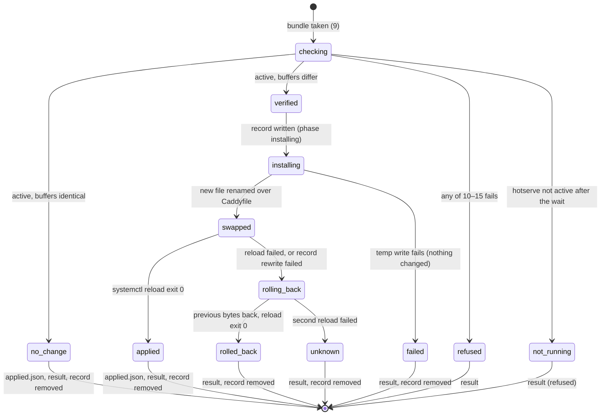
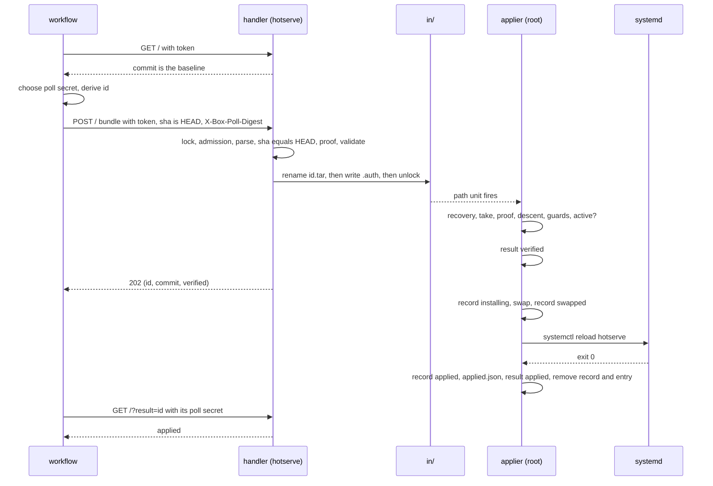
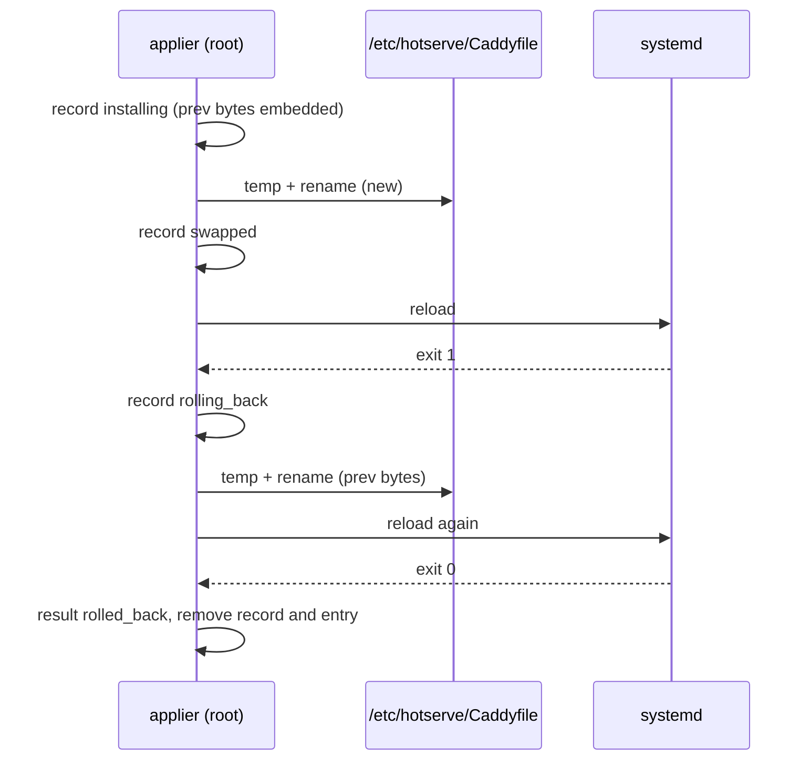

# DESIGN — box

This document describes the present: what is built, why, and what it
promises. History lives in git (`git log -- box/DESIGN-box.md`); the
"History" section at the end holds only dated one-liners. Amendments
are for decisions still fresh or contested and get folded into the
body once they settle.

**Status: design, written before the code.** Normative for the PRs
that build it (proof core, Caddyfile surface, applier, `init`,
template, docs); a PR that cannot hold a line here changes the line in
the same PR, with the reason. Until the applier ships,
`examples/box/bin/push` is how config reaches a box, and `box_webhook`
answers `GET /` as the Handler contract says and refuses every other
authenticated request on `/` — a push, a result poll — with 501
(Message catalogue), a push's body unread.

**Two rules of this document.** Every fact lives in exactly one table;
prose uses it and points to it, and never restates it, so a change
lands once. And the document specifies *invariants, states, durable
writes and messages*; the exhaustive crash cases are PR 3's
table-driven tests, which cite the invariants by id. The "Review
checklist" at the end is the set of questions a change to this file
must answer before it is pushed.

`box` is the subsystem that writes `/etc/hotserve/Caddyfile`. It is
not liveswap's: applying the whole file covers Caddy sites, the cache,
penaltybox and liveswap alike. It sits beside liveswap and penaltybox,
imports liveswap's deploy-trust verifier (the allowed direction), and
owns three things: the `box` global option and `box_webhook` site
directive, the root applier unit, and `hotserve init` / `hotserve box
…`. The wider attack surface it changes is in
[DESIGN-threat-model.md](../DESIGN-threat-model.md), "Config webhook"
and T6.

## Glossary

| Term | Means exactly |
|---|---|
| **bundle** | One gzip tarball the workflow POSTs: `path`, `Caddyfile`, `commit`, `parents/NNNN`, `trees/<sha>`, nothing else. |
| **HEAD** | The commit the bundle is for: `sha1("commit <n>\0" + raw)` of the bundled `commit` object, computed, never read. |
| **baseline** | The commit the box runs: `sha` in `applied.json`. Advances only as the state machine says. |
| **chain** | HEAD plus the bundled `parents/` commits, first-parent from HEAD down to, not including, the baseline, each linked to the next by hash. HEAD is always on it, so the chain is never empty: whatever would write — root, and the handler's pre-verification before validate — checks HEAD's signature against the installed list, HEAD equal to the baseline included (then the chain is HEAD alone and `parents/` must be empty). The one answer given without it is step 4's `no_change` fast path, which writes nothing: HEAD is the baseline and the bundled bytes are the installed bytes, verified when they applied. `parents/` is also empty when HEAD's first parent is the baseline. The cap counts HEAD. |
| **installed file** | `/etc/hotserve/Caddyfile` as root last wrote it. The source of the signer list and the rollback bytes. |
| **record** | `txn.json`: the one durable marker of a transaction in flight, with a `phase`. Present means "no terminal result yet". |
| **result** | `out/<id>.json`: what a push came to. Non-terminal: `verified`. Terminal: `refused`, `no_change`, `applied`, `failed`, `rolled_back`, `unknown`. |
| **marker** | `stage/<id>.auth`: the handler's note that a push with id `<id>` was admitted, holding the digest of its poll secret. |
| **pending** | A push that blocks admission: a bundle in `in/`, or a marker younger than fifteen minutes with no terminal result. See "Admission". (A result poll's answer for a marker with no result yet is `admitted`, whatever the marker's age.) |
| **poll secret** | 32 random bytes the *workflow* generates for each push. The push carries only its digest (`X-Box-Poll-Digest`); a result poll carries the secret itself as `Authorization: Box-Poll <base64>`, which Caddy's access log redacts as it never does a custom header, and needs no other credential. The box stores the digest and never receives the secret with a push. |
| **id** | The first 32 hex characters of `sha256(poll secret)`, so the client knows it before it asks and a lost response loses nothing. Not an arrival order: the applier orders by the marker's `posted` time. |
| **active** | `systemctl is-active hotserve` says `active`. `activating` is waited out (bounded); anything else is "not running". |

## Why this subsystem exists

The Caddyfile is where the box's policy lives: which repository may
deploy each app, each Deno app's permission flags, which hosts are
served, and — with this subsystem — who may change the file itself.
Before it, the file reached the box by a hand edit as root on day 0
and afterwards by `examples/box/bin/push`: a laptop script over SSH as
an administrator whose sudoers file allowed eight fixed commands. That
shape could not promise three things.

- **The change was whatever the laptop sent.** `bin/push` pushed the
  file beside it. Nothing tied the bytes to a commit, a review or a
  person; the README asked for "merge, then push from a checkout of
  main" as a ritual.
- **The administrator was a standing privileged account.** Eight
  sudoers lines, a group, an SSH key, and a "prove `sudo -n` works
  before you close root" step on page 2 of the tutorial. Secrets rode
  the same account (`sudoedit`).
- **The box could not be told who it belonged to.** A compromised
  laptop, a leaked GitHub token or an OAuth app with `contents:write`
  all had routes to the file, and the box had no way to tell them from
  the operator.

With `box`, the file is written in exactly one place — a private
repository of the operator's — and the box applies a commit only if
(a) a token proves it came from that repository's `main` workflow,
(b) an SSH key the box lists signed the commit and every commit on the
chain, (c) the file sent is the file in that commit, and (d) the
commit descends from the one the box runs. On the normal path root is
used twice in a box's life: to install the package, and to tell the
box which repository it belongs to. The console stays the way back —
a rewritten history (`hotserve box baseline`), a renamed deploy host
or directory (`init` again), a config that broke the webhook site
itself ("At 3am") — and nothing here promises that it is never needed
again.

## The shape

The repository holds one directory per box; the box is one file:

```
box1/Caddyfile                 # the whole config
.github/workflows/apply.yml    # validates every push and PR; applies main to the box
Makefile                       # make signer, make check, make wip
```

The Caddyfile's global options carry a `box` block beside `admin`, and
exactly one site carries `box_webhook`:

```
{
	admin unix//run/hotserve/admin.sock

	box {
		deploy_trust github {
			audience hotserve
			claim repository your-org/boxes
			claim ref refs/heads/main
		}
		# signers
		signer alice@example.com ssh-ed25519 AAAAC3Nz…
	}

	liveswap { … }
}

example.com { reverse_proxy { dynamic liveswap example } }

deploy.example.com {
	liveswap_webhook     # deploys: POST /<app>
	box_webhook          # this file: POST / from the workflow
}
```

- `deploy_trust` is liveswap's grammar and verifier, unchanged
  (`deploytrust.Parse` and `Limiter.Authenticate`,
  liveswap/deploytrust/): GitHub, GitLab, generic OIDC and the local
  key come for free, and the 401, the 429 and the `refused` journal
  line are the same shape as a deploy's. A `box` token must carry a
  `sha` claim (GitHub's does; `hotserve deploy-token --claims sha=…`
  mints one); a source that cannot supply it is refused by name.
- `signer <principal> <key-type> <base64>` is one person's SSH public
  key. The principal matches `^[A-Za-z0-9._@+-]+$` and nothing else
  (allowed_signers principals are patterns with `*`, `?`, `!` and `,`;
  none may appear). Key types: `ssh-ed25519`, `ecdsa-sha2-nistp256/
  384/521`, `sk-ssh-ed25519@openssh.com`,
  `sk-ecdsa-sha2-nistp256@openssh.com`, `ssh-rsa`. The base64 must
  decode to a key of the declared type and be that key's one canonical
  line (the decoder forgives a newline inside a quoted token; the
  allowed_signers file would not). The principal is at most 256 bytes.
- `box_webhook` takes no arguments and no matcher: a matcher is an
  argument to Caddy, and `box_webhook /hook` would adapt and leave `/`
  unserved, so the directive's parser and the walk both refuse one by
  name. It handles exactly the path `/`
  (with or without `?result=`) and passes every other path to the next
  handler. It must run before `liveswap_webhook`, which is terminal on
  every path it sees, and Caddy's `RegisterDirectiveOrder` can only
  anchor on a *standard* directive (it panics otherwise) and inserts
  immediately before the anchor — so anchoring on `reverse_proxy`, as
  liveswap does, would place `box_webhook` *after* `liveswap_webhook`
  and the channel would be dead. `box_webhook` is therefore anchored
  `Before, "redir"`, a standard directive earlier than `reverse_proxy`,
  and a unit test adapts the example Caddyfile and asserts the route
  order. The site
  that carries it has exactly one address, a bare hostname: no scheme,
  port, path, wildcard, placeholder or second name. That hostname is
  the address the workflow posts to and the box's identity (see "The
  box's identity"); the directory name (`box1`) is a label.
- The signed file is the whole configuration. It contains no `import`,
  every site block is braced, and no token at directive position, in a
  site address or inside the `box` block contains `{$`. Placeholders
  stay legal in values. See "Reading the signed file" for why each
  rule exists and what it does and does not guarantee.

## The trust chain (normative)

A step that fails stops the chain; the installed file is unchanged;
the result carries the message from the catalogue. Numbers are used as
cross-references throughout.

**In the hotserve process (the `box_webhook` handler, uid hotserve):**

1. **Token.** `Authorization: Bearer <JWT>` is verified against the
   `box` block's `deploy_trust` sources through the one exported
   liveswap entry point both handlers call, `Limiter.Authenticate`
   (liveswap/deploytrust/), which returns an `Identity` — the
   attribution string and, behind `Identity.Claim`, the verified
   claims — or the `Refusal` the handler writes. The flat 401, the
   failure budgets and the 429, the `webhook auth failed` line with
   `refused` and the `could not consult a trust source` line are
   liveswap's; the budgets are shared across both webhooks.
2. **Admission.** See "Admission": the admission lock is taken, the
   pending and `in/` checks run, and a request that does not pass is
   409 before any body is read. Method, media type and body size are
   checked here too (405, 415, 413).
3. **Bundle.** Parsed from memory under the rules in the Caps table:
   regular files only, fixed names, per-type caps, the decompressed
   stream stopped at its cap. The same parser runs in the applier.
4. **Token ↔ bundle.** The token's `sha` claim must equal HEAD. This
   binds the bundle to the commit the run is for; without it any
   signed descendant of the baseline, a signer's unmerged branch tip
   included, would pass steps 11 to 13. This check is the handler's
   alone: the token is not in the bundle, and root cannot verify an
   OIDC token offline. Its absence from root's checks is T5's reach
   through root; see "Threat-model deltas". **Fast path, here and not
   earlier:** once the token, the poll-digest header (step 2) and this
   binding have passed, if HEAD equals the baseline and the bundled
   file's digest equals the installed file's, nothing on disk would
   change, so the handler answers 200 `no_change` with no admission
   lock, no drop and no root work — it skips only the work that would
   write. An OIDC holder posting the applied `HEAD` in a loop learns
   what `GET /` already tells it; a token without the right `sha`, or
   a POST without its digest, is refused as it would be on the slow
   path. (After a console edit the digests differ and the push goes to
   root, which reinstalls HEAD's file by design; the next replay takes
   the fast path again.)
5. **Pre-verification.** The handler runs the applier's proof code
   (steps 10 to 13) before anything touches the staged file, so a
   signed commit paired with other Caddyfile bytes fails here and
   validate only ever sees bytes a listed signer committed. The shared
   verifier takes the uid to run `ssh-keygen` as, 0 meaning "as I am";
   the handler passes 0 and uses `hotserve.service`'s own `PrivateTmp`.
   A courtesy, not the boundary: root repeats every check.
6. **Validate.** `/usr/bin/hotserve validate --adapter caddyfile
   --config <staged file>` as a bounded child with the service's own
   environment, and `/usr/bin/hotserve-backup validate <file>` when
   that binary is executable (`test -x` exit 1 is "not installed"; any
   other failure refuses as "could not tell"). Output reaches the
   response and the journal only through liveswap's redactor primed
   with that environment. Root never runs either: `caddy validate`
   provisions every module and the adapter expands `{$VAR}` from the
   caller's environment and runs each module's parser on the input.
   The same step reads the file's adaptation (`hotserve adapt
   --adapter caddyfile`, a child bounded the same way) for
   **reachability**: a `GET` and a `POST` for `/` on the `box_webhook`
   host must meet `box_webhook` before any handler that can answer
   them — no `order` option, second site for that host (`host/*`, which
   Caddy sorts ahead) or anything else may serve `/` first. Like the
   rest of this step it is a courtesy against a signer's mistake, not a
   boundary: root never adapts, so step 15 checks presence alone.
7. **Drop.** The bundle, assembled in `stage/`, is renamed into `in/`
   as `<id>.tar`; only then is the marker written with the poll
   secret's digest and the time (see "Admission" for why in that
   order); then the admission lock is released. The handler logs `box
   push accepted` with `id`, `commit`, `via` and `remote`. Nothing about
   the caller is handed to root.
8. **Answer.** The handler polls `out/` every second for at most 30 s
   and answers by the first phase it sees, per the Handler contract
   table: `verified` → 202 `{id, commit, phase}`; `no_change` or
   `applied` → 200 with the result; `refused`, `failed`, `rolled_back`
   or `unknown` → 422 with the result (a fast transaction can be
   terminal before the first poll, and a red outcome is never carried
   by a 2xx); nothing yet → 504 `{id}`. The workflow already holds the
   id and the secret, so a lost response, whichever status it carried,
   is recovered by `GET /?result=<id>`. The handler never waits past
   the first result ("Why 202 and a poll").

**In the applier (`hotserve box apply`, root, one shot, path-triggered):**

9. **Recover, then take.** Under root's blocking lock the applier
   first settles anything a crash left (the "Recovery" column of the
   States table and the Failure-mode table), then renames every entry
   of `in/` into `work/` — whatever it is; `CAP_DAC_OVERRIDE` and
   `CAP_FOWNER` exist so that nothing the hotserve uid creates can
   stay. An entry whose name is not `<id>.tar`, or which is not a
   regular file, has no legal result name: it is removed with an
   error-level journal line and no result. The rest are processed in
   order of their markers' `posted` time (an entry with no readable
   marker goes last). A push settles once: a bundle whose id already
   has a terminal result (on disk, or journaled by this run; a result
   that does not read, or whose phase is not terminal, counts as none —
   out/ is root's alone, so only a disk fault or the console makes a bad
   one) — back in `in/` after a power loss beat
   the durability of its unlink, or replayed by the hotserve uid — is
   removed with a warning and never run again, for as long as Retention
   keeps that result; a take that fails writes no `failed` over it. A
   result journaled in an earlier run, never written, protects nothing
   (I3's exception): its push may run again. The order
   decides only which pending bundle is tried first, the descent check
   decides each outcome. Each bundle is
   opened `O_NOFOLLOW|O_NONBLOCK`, checked `S_ISREG`, read once through
   a reader that stops at the cap plus one byte, and never touched on
   disk again: a writer holding a descriptor from before the rename
   cannot change what was verified, because nothing is verified from
   disk.
10. **The installed file.** Read once into a buffer that is both the
    signer list's source and the rollback bytes. Signers come from the
    raw token stream (see "Reading the signed file"), never from the
    running configuration and never from an imported file. An empty
    list refuses. The out-of-band flag — installed digest ≠
    `applied.json`'s `sha256` — is computed here and stored in the
    record.
11. **Identity.** The incoming file's `box_webhook` hostname equals the
    installed file's, and the bundle's `path` equals the path in
    `applied.json`. See "The box's identity".
12. **Signature.** The commit's `gpgsig` is an SSH signature over the
    commit object with that header removed (git's rule, continuation
    lines included). An allowed_signers file is generated from the
    installed signers (`<principal> namespaces="git" <type> <base64>`).
    Which listed key signed is the box's own decision: the SSHSIG blob
    carries its public key, matched byte for byte against the list, so
    "unlisted" never depends on ssh-keygen's exit status; the blob's
    namespace must be `git`, refused by name otherwise. Then
    `ssh-keygen -Y verify -n git -I <principal>` runs as uid 65534 with
    an environment of `PATH` alone, the payload on stdin; its exit
    status is the verdict — but that status is the same for "the
    signature is wrong" and "I could not read my files", so a failure
    counts as a verdict only when a built-in control signature (a
    throwaway key's, over a fixed payload; public half and signature
    only) verifies in the same run, as the same uid, in the same
    directory. Control verified, push not: the signature does not
    verify over the commit — altered after signing, or made with a
    form of key this ssh-keygen will not take — which is the push's
    problem. Neither verified: the box's error, never a refusal. A
    signer line ssh-keygen would refuse to read (an RSA key under its
    1024-bit floor) is refused by `init` and the walk, so a list the
    box accepts is one ssh-keygen accepts.
    No `gpgsig`, an OpenPGP `gpgsig`, a `gpgsig` of neither kind or one
    the box cannot read, a `gpgsig-sha256`, an unlisted key, and an
    altered commit each refuse by name.
13. **The file is the committed file.** The root tree's id equals the
    commit's `tree`; the `path`'s components are walked through the
    bundled trees (depth per the Caps table); the last entry is a blob
    (`100644`/`100755`) whose id is `sha1("blob <n>\0" + file)`. A
    symlink, submodule or tree at the path refuses; a SHA-256
    repository refuses. Plain `crypto/sha1`, not sha1dc, is an accepted
    residual.
14. **Descent, every step signed.** The chain is walked first-parent
    from HEAD, linked by hash: `parents/0001`'s id equals HEAD's first
    `parent` header, each next entry's id equals the previous entry's
    first `parent` header, and the walk ends at a header equal to the
    baseline (whose object is not bundled). An unreferenced entry, a
    gap, or an entry past the end is a malformed bundle. The chain
    reaches the baseline within the cap, and **every commit on it
    carries a signature step 12 accepts**: otherwise an unsigned commit
    pushed by a leaked credential would ride in under the next signed
    one. HEAD equal to the baseline is a chain of HEAD alone (see the
    Glossary): root still checks its signature, no parent may be
    bundled, and step 16 decides whether anything changes (the
    handler's step-4 fast path has already answered the case where
    nothing would). A history longer than the cap fills the chain
    exactly and still names a parent: that is the cap's refusal, not
    the descent one. A commit
    between the baseline and HEAD is refused by what its verdict was —
    unsigned, listed-but-unverifiable (its own message), or signed by a
    key the box did not list when it last applied, named by the
    principal the *incoming* file gives that key, or "not in the new
    Caddyfile either". A verifier that could not answer (ssh-keygen
    could not run, the chain deadline passed) is the box's error, never
    a refusal. What this rule does and does not stop is in "The merge
    button" and "Threat-model deltas".
15. **Never cut the branch you sit on.** The incoming file has a `box`
    block with at least one `signer` and a `deploy_trust` block with at
    least one line (token-level presence; root runs no directive
    parser), exactly one site carrying `box_webhook`, and still lists
    the key that verified HEAD. Rotation is therefore two *applied*
    pushes. This guard checks presence, not reachability: reachability
    is the handler's (step 6), which root cannot repeat; the console is
    the guarantee behind both.
16. **Install or not.** From here the state machine governs: active?
    changed? See "The install transaction".

Steps 10 to 15 are one function the handler's pre-verification (step
5) and the applier share, run cheapest first: the two files' readings
and the identity (10, 11 and 15's presence rules), the file proof
(13), the chain's linkage (14), then every signature on the chain,
HEAD's first (12 and 14), then 15's key guard — so a malformed bundle
never starts `ssh-keygen`, and when more than one step would refuse,
the first so found is the one named. Step 16 waits out `reloading` as
it does `activating` — a reload in flight, the console's or one a
killed applier started, ends in `active` or a failure — within one
budget per run: 300 s from the run's first sight of either, so the
waiting in a run is that long, plus one is-active question (bounded at
30 s) per ask, whatever hotserve does. The accepted cost: a later
episode in the same run, once the budget is spent — after recovery
waited out a boot, say — gets no wait, so its push is refused as still
starting and the workflow's run fails; a re-run pushes again. After the wait, one classification serves every caller:
hotserve is *up* when it is `active` or still `reloading` (a reload
then queues behind the one in flight); `activating` (a start, or a
restart loop, which reads the file on disk when it gets there) and
every other word is not running. A push is refused on anything but
`active`, with the "still starting" text after a wait that timed out.
`init` asks once, when it begins (after its recovery, whose wait may
have spent the run's budget); the residual is a hotserve whose state
is or becomes other than that answer says — a start in flight, already
`activating` when `init` asks or begun since, that read the old bytes
and then succeeds serves them until the next reload, while `init`
reports the swap applied for the next start; a hotserve that stops
after `init` found it up ends `unknown`, both reloads refused. The installed file failing the
walk for a reason other than an empty signer list, `applied.json`
missing or unreadable, `ssh-keygen` unable to answer and `is-active`
unanswered are the box's errors: `failed`, never `refused`
(Transitions table, "checking → failed").

**`init`'s path through the chain.** `init` is the console seeding or
re-seeding the box's identity, baseline and signers, so steps 10 to 15
— every comparison against the installed file and `applied.json` —
do not apply to it: on a fresh box there is no `applied.json` and the
packaged Caddyfile has no `box` block, and on a rebind the new host or
path is the point. `init` runs "Reading the signed file" on the
incoming file (the structural refusals: `box` block, signers,
`deploy_trust`, one bare-hostname `box_webhook` site, no `import`, no
placeholder at a directive position, braces), validates it (step 6's
way), then enters the state machine at `installing` under root's lock
with `origin: init`, and writes `applied.json` from the arguments it
was given. Its authority is root at the console; the file it installs
is the new "installed file" every later push is checked against.

Running apps are never restarted by an apply, as with any reload
(liveswap's "reload trap"): a changed `app` block applies at the app's
next launch.

### Why 202 and a poll

A request that waits for the apply to finish while the applier runs
`systemctl reload` never completes. `hotserve reload` posts to the
admin API, which provisions the new configuration and then stops the
old one; stopping the HTTP app calls `http.Server.Shutdown` with no
deadline (no `grace_period` is set, and one would cut the connection
instead), and `Shutdown` waits for every in-flight request — including
the one waiting for the reload. So the applier publishes `verified`
before it reloads and does not wait to be read; the handler sees it
within one poll interval and answers; the workflow asks `GET
/?result=<id>` — a fresh request, served by whichever configuration
runs — until the phase is terminal. A push that changes nothing is
answered 200 synchronously. liveswap never met this: a deploy does
not reload Caddy.

## The install transaction

### Invariants

Every transition below preserves all of these; PR 3's tests cite them
by id.

| Id | Invariant |
|---|---|
| **I1** | For every write the applier or `init` makes: `/etc/hotserve/Caddyfile` exists at every instant and is a complete file written whole — one that ran, one whose reload is pending or in progress under a record that says `swapped`, or (`origin: init`, box not running) one that loads at the next start; a failed reload puts the previous bytes back, and a crash leaves a record saying which. The console is root and may write anything; the applier detects such a write by digest (steps 10, 17, 19) and reports it, never overwrites it knowingly, and never records a baseline for bytes it did not install. |
| **I2** | Every entry the applier *listed* in `in/` leaves `in/` in that run (a bundle landing after the last listing is the next run's); `work/` is empty on every exit except two that leave the record on disk for the next run — the one named full-disk case in the Failure-mode table, and a stop with everything left as found (a record that does not read, the installed file unreadable mid-transaction, `is-active` unanswered in recovery) — where what was taken stays in `work/` with it and the next run's recovery settles it; `in/` receives nothing but a complete bundle by one `rename`. |
| **I3** | Every bundle the applier takes ends in exactly one terminal result, or — only when the result cannot be written — one error-level journal line carrying every field the result would have; an entry that is not a bundle gets the journal line only, and a bundle whose push already settled (step 9) a warning line only — or, if its take fails, the take's error line. |
| **I4** | The baseline advances only from a transaction whose durable record says `applied` (reload confirmed) or `no_change` on an active box, from `init`, or from `baseline`; all four hold root's lock; it never runs ahead of the record. |
| **I5** | Within a transaction: from the first write that changes `/etc/hotserve` or `applied.json` until the terminal result, the record exists; it is written atomically before that first write and is the last thing removed. Refusals and `verified` precede it and write none. `hotserve box baseline` is not a transaction: one atomic write of `applied.json` under the lock, after recovery, with no record — a crash before its rename changed nothing, after it the reset is done; a retry is idempotent. |
| **I6** | Root installs nothing a listed signer did not sign (every chain commit), nothing that fails the file proof, nothing that does not descend from the baseline, nothing for another host or path. |
| **I7** | No pending outlives its bound: a marker stops blocking admission at fifteen minutes (the file, holding the poll secret's digest, is kept by Retention); a bundle in `in/` blocks admission until root takes it, with no age-out. |
| **I8** | Every write that recovery reasons from is durable before the next step: the temporary is `fsync`ed, renamed, and the parent directory `fsync`ed. |

### States

The record's `phase` is the state. Recovery acts on the phase, after
checking the installed file's digest `d` against what the phase
implies; it never infers state from digests alone.

| Phase | Meaning | `d` must be | Recovery (crash found this phase) |
|---|---|---|---|
| *(no record)* | No transaction in flight. | — | A `work/` entry with a terminal result (on disk, or journaled earlier in this run: step 9): remove the entry. With a `verified` result or none: write `failed` ("interrupted before the Caddyfile changed"), remove the entry — and if that `failed` cannot be written, remove the `verified`, so Retention settles the push. The applier's own leftover temporaries (Transitions table) are removed. |
| *(record unreadable)* | `txn.json` does not parse, or is not the shape only root writes (a phase above, ids, digests, `prev` hashing to `prev_sha256`, a `no_change` record's two digests equal, a `path` of safe components). Root writes it whole by rename, so this is a fault no other row reasons about. | — | Write nothing anywhere; error-level journal line; take nothing from `in/`. The path unit re-runs until its trigger limit; the console reads and removes the record. Exit 0: the one non-zero exit is the full-disk end. |
| *(any phase, terminal result present)* | The transaction ended; only its removals were owed. | — | Remove the record, then the entry (Failure-mode table, "terminal result"). |
| `no_change` | Buffers identical; only the baseline advances. | `prev` | Write `applied.json` (idempotent), result `no_change`. |
| `installing` | Record durable; swap not yet done. | `prev` | `failed` ("interrupted before the Caddyfile changed"). If `d == new`, the crash fell after the swap: act as `swapped`. |
| `swapped` | New file on disk; reload unconfirmed. | `new`, or `prev` (the bytes are already back: continue as `rolling_back`) | Write the previous bytes back, phase → `rolling_back`, continue as that row. Exception: `origin: init` with `d == new` on a box that is not running → finish as `applied` (init's rule: a person is at the console). |
| `applied` | Reload confirmed; `applied.json` may not be written yet. | `new` | Write `applied.json` (idempotent), result `applied`. **If `d ≠ new`, the file changed after the reload (a console edit): do not advance the baseline; result `unknown`.** |
| `rolling_back` | Reload failed (or the record could not follow the swap); previous bytes going back. | `prev`, or `new` (crash before the write-back: write them back) | Reload if hotserve is up (step 16's classification: `active`, or still `reloading` after the wait) → `rolled_back` with the record's `error`; reload fails → `unknown`; not running (anything else, a restart loop still `activating` included) → `failed` ("the previous Caddyfile is on disk; hotserve is not running"), as for `origin: init` on a box that was not running when it began, which never reloads. `d` neither: the `any` row. A write-back that fails ends as the full-disk end (Failure-mode table). |
| any | `d` matches neither `prev` nor `new`. | — | A console edit under the transaction: write nothing to `/etc/hotserve`, result `unknown` ("the Caddyfile changed during the transaction; it is left as found"), journal at warning level. |

### Record and result fields

| File | Field | Set by | Meaning |
|---|---|---|---|
| record, result | `id` | the workflow (derived from its poll secret), carried by handler and applier | the request id |
| record, result | `commit` | applier | HEAD |
| record, result | `path` | applier | the bundle's `path`, equal to `applied.json`'s |
| record, result | `signer` | applier | the principal whose key verified HEAD; `init` in a record `init` wrote |
| record | `origin` | applier, `init` | `applier` or `init`; recovery honours it (States table) |
| record | `prev`, `prev_sha256` | applier | the installed file's bytes (base64) and digest at step 10 |
| record | `new_sha256` | applier | the incoming file's digest |
| record, result | `diff` | applier | unified diff, redacted (layers 3 and 4), capped per Caps |
| record, result | `apps` | applier | app names from the incoming file's token walk: the global `liveswap` block's `app` lines whose name is in liveswap's app-name grammar (one outside it fails the load anyway), so a result's size stays under the handler's read cap |
| record, result | `box_webhook` | applier | the host |
| record, result | `caddyfile_edited_out_of_band` | applier | step 10's flag |
| record | `phase` | applier | the state (States table) |
| result | `phase` | applier | `verified` or a terminal phase |
| result | `error` | applier | the catalogue message for a non-green phase, bounded per Caps |
| record | `error` | applier | in a `rolling_back` record, the catalogue text its `rolled_back` result will carry, so recovery reports the reason the live run would have |
| `applied.json` | `sha`, `path`, `sha256`, `signer`, `when` | applier, `init`, `baseline` | the baseline, this box's path, the installed digest, who verified, when |
| marker | `sha256`, `posted` | handler | digest of the poll secret; time of admission |

A result carries what was established before its phase: a refusal at
step 9 has `id`, `phase` and `error`; one past the bundle's parse adds
`commit` and `path`; `signer`, `box_webhook`, `apps` and the out-of-band
flag come once steps 10 to 15 pass, and `diff` once hotserve is found
active. A transaction with `origin: init` writes no result file at any
phase — its caller prints the outcome, and recovery journals it.



### Transitions and their durable writes

| From → to | Event | Durable write(s), in order | Guards |
|---|---|---|---|
| in/ → work/ | step 9 takes an entry | the entry renamed into `work/` → `work/` and `in/` fsynced | I2, I8 |
| checking → refused | A check in 10–15 fails | result `refused` → entry removed | I2, I6 |
| checking → failed | the box's own error in 9–16: the bundle unreadable, `applied.json` missing or unreadable, the installed file unreadable or failing the walk for any reason but an empty signer list, `ssh-keygen` unable to answer or the chain deadline passed, `is-active` unanswered | result `failed` ("the install failed before the Caddyfile changed: <error>; nothing changed", the catalogue's) → entry removed | I2, I3; never `refused` (step 12) |
| checking → not_running | `origin: applier` and `is-active` is not `active`: `inactive`/`failed` at once, or still `activating` or `reloading` when the run's 300 s wait ends | result `refused` — "hotserve is not running; nothing applied" for `inactive`/`failed`, "hotserve is still starting after 300 s; nothing applied" after a wait that timed out, the catalogue's two messages → entry removed | I2; I4: nothing advances |
| checking → no_change | active (or `origin: init`); incoming buffer == installed buffer | record `no_change` → the installed file's digest re-read, still `prev_sha256` (a console edit since step 10 → `unknown`, "the Caddyfile changed during the transaction; it is left as found", baseline not advanced, record removed, entry removed; unreadable → the stop-as-found of I2) → `applied.json` → result `no_change` → record removed → entry removed | I1, I2, I4, I5. Every write of `applied.json` — this one, `swapped → applied`'s, and recovery's — is preceded by that re-read, after any wait before it |
| checking → verified | active (or `origin: init`); buffers differ | result `verified` (if this write fails: result `failed` in its place if that can be written, else any `verified` whose rename landed removed; the `work/` entry removed; nothing else changes) — `init` writes no result, it prints | I3 |
| verified → installing | — | record `installing` (prev bytes embedded) | I5, I8 |
| installing → failed | a temporary cannot be written | remove temporaries; result `failed` → record removed → entry removed | I1 (file untouched), I2 |
| installing → swapped | the installed file's digest is re-read and still equals `prev_sha256` (a console edit since step 10 → `unknown`, "the Caddyfile changed during the transaction; it is left as found", record removed, entry removed); then the new file is written to a temp and renamed over `Caddyfile` | record `swapped` | I1 (file exists at every instant). The reread and the rename are not atomic: a bare console edit landing in that window is overwritten, and one landing after the post-reload check is reported as out-of-band by the next push, not refused. `hotserve box edit` is the console tool that holds root's lock through an edit and reload, and the one "At 3am" names; a bare edit is root's right and races as stated. |
| swapped → rolling_back | record rewrite to `swapped` fails, or reload fails | record `rolling_back` (if writable) → previous bytes written back | I1 |
| swapped → applied | `systemctl reload hotserve` exits 0 — or `origin: init` on a box that is not running, where the swap counts as applied with no reload (a person is at the console; the file loads at the next start) — and the installed file's digest, re-read, still equals `new_sha256` (a console edit since the swap → `unknown`, baseline not advanced, as the States table's `applied` row) | record `applied` → `applied.json` | I4 (record before baseline; the digest check is why "applied" means these bytes) |
| rolling_back → rolled_back | previous bytes back, reload exits 0 | result `rolled_back` → record removed → entry removed | I1, I2 |
| rolling_back → unknown | second reload fails | result `unknown` → record removed → entry removed | I2, I3 (bytes that cannot be written back are the full-disk end: Failure-mode table, "previous bytes back") |
| applied → done | — | result `applied` → record removed → entry removed | I2, I3, I5 |

Order within a row is the order on disk. Every terminal result is
followed by the record's removal (where one exists) and then the
entry's (I2); "record removed" always follows "result written" (I5)
with one exception, the full-disk row of the Failure-mode table. Each
write is a temporary in the same directory, renamed over the name
(I8): `.Caddyfile.box-<id>` for the Caddyfile, `.txn.json.tmp`,
`.applied.json.tmp` and `out/.<id>.json.tmp` for the rest — every one
in a directory only root writes; recovery removes any it finds, and
reads none.

### Failure-mode table

One row per durable write. "Write fails" is the applier's own action
failing (`ENOSPC`, `EIO`); "crash after" is a kill or power loss once
the write is durable. The workflow column is what `GET /?result=<id>`
shows after recovery.

| Write | Write fails → | Crash after → recovery | Terminal phase | Workflow sees |
|---|---|---|---|---|
| take (`in/` → `work/`) | remove the entry where it stands in `in/` (I2); a regular file named `<id>.tar` gets `failed` ("the install failed before the Caddyfile changed: <error>; nothing changed"), written before the removal, unless its push already settled (step 9). A rename that landed, only a directory's `fsync` failing, is a take, not known durable (error line); should `in/`'s unlink not persist, the entry comes back after its push settled and step 9 removes it while its terminal result is on disk | no record, entry in `work/`, no result → `failed` ("interrupted before the Caddyfile changed") | `failed` | `failed` |
| result `refused` | journal (error), remove entry | entry with terminal result → remove entry | `refused` | 422 or the result; if unwritten, `admitted` until the workflow's bound, then red naming the journal |
| result `verified` | result `failed` in its place (over a `verified` whose rename landed); if that fails too, remove any such `verified`; remove entry; file untouched | no record, result `verified` → rewrite `failed`, remove entry | `failed` | `failed`; if neither write lands, `admitted`, then `failed` ("the box has no record of this push") from Retention at root's first later run past fifteen minutes |
| record `no_change` | result `failed`; nothing changed | phase `no_change` → `applied.json`, result | `no_change` / `unknown` (a console edit since step 10) | per phase |
| record `installing` | result `failed`; nothing changed | phase `installing`, `d == prev` → `failed` | `failed` | `failed` |
| new file temp + rename | remove temp; result `failed` — unless the installed file now reads otherwise: as `new` (the rename landed and only the directory's `fsync` failed), the post-swap failure of the next row; as neither, the `any` row; unreadable, the stop-as-found of I2, the record left for recovery | `d == new` with phase `installing` → treat as `swapped` | per `swapped` | per `swapped` |
| record `swapped` | **post-swap failure**: record `rolling_back` if it can be written, then the previous bytes back; if they cannot be written back, leave the record (phase `installing`, or `rolling_back` if that write landed; `d == new`) and the entry, and exit non-zero with an error-level line ("disk full; the previous Caddyfile could not be restored") — the path unit re-triggers until its limit and fails; the console frees space, then `systemctl restart hotserve-box-apply.path` (`reset-failed` alone clears the state but does not start a unit that hit its trigger limit) | phase `swapped` → rollback path | `rolled_back` / `unknown` | per phase |
| reload | non-zero exit → rollback path | phase `swapped` (the reload's outcome unknown) → rollback path | `rolled_back` / `unknown` | per phase |
| record `applied` | the reload succeeded but the record cannot say so, and the baseline must never run ahead of the record (I4): take the rollback path exactly as the `record swapped` row — previous bytes back, reload, result `rolled_back` ("the record could not be updated after a successful reload (disk full); rolled back to keep the file and the record consistent") or, if the write-back fails too, the full-disk end above | phase `applied`, `d == new` → `applied.json`, result | `rolled_back` / `unknown` | per phase |
| `applied.json` | journal (error); result `unknown` ("applied but the baseline could not be recorded; `hotserve box baseline <sha>`") | phase `applied` → idempotent rewrite | `applied` / `unknown` | per phase |
| previous bytes back | retry once (a write whose rename landed counts); else the full-disk end of the `record swapped` row: no result, record and entry kept, exit non-zero — a result written here would make the next recovery drop the record (the `terminal result` row), and with it the only copy of the previous bytes | phase `rolling_back`, `d` checked, bytes written back if needed | `rolled_back` / `unknown` | per phase |
| terminal result | **full disk**: error-level journal with every field; remove record and entry anyway (both `unlink`s). At a terminal phase the disk is settled and only the report is owed; a record kept would spin `PathExists=txn.json`. | result exists, record present → remove record and entry | as logged | the last result on disk — `verified` for a transaction past that phase, else `admitted` — until the workflow's bound, then red naming the journal |
| record removed | retry; cannot fail for space | record gone, entry present → remove entry | — | — |
| entry removed | retry; cannot fail for space | `work/` non-empty → path unit re-runs recovery once | — | — |

### Triage: which failures to defend

The tables above say what each failure does; this says which ones the
code must handle and which are accepted. A finding — from a review, a
test or the field — is scored on three axes (FMEA's), then the rule
decides. Without it every edge case looks mandatory, and each guard
added for a multi-fault case becomes a new branch for the next one.

| Axis | 5 | 4 | 3 | 2 | 1 |
|---|---|---|---|---|---|
| **Severity** — the effect if it happens | installs bytes no listed signer signed, or advances the baseline wrongly (I6, I4) | the box wedged until the console | a wrong verdict the workflow trusts (green for a push that did not apply, or the reverse) | a wrong message; red where green was due | logging only |
| **Occurrence** — what must go wrong | normal operation | one common fault: a crash, a failed reload, hotserve restarting | one rare fault: `EIO`, a full disk, a clock step | two independent faults | three or more, or root-only state (`txn.json`, `out/`, `applied.json`) corrupted |
| **Detection** — how it surfaces | silently | — | a wrong but plausible answer | — | red, with a journal line naming it |

The rule, in order:

1. **Severity 5 is fixed**, whatever its occurrence.
2. **Single faults are fixed** (occurrence 3 or more): the box must
   end correct, or red and named, under any one fault — the
   single-fault criterion of safety engineering.
3. Anything else is fixed only if severity × occurrence × detection is
   20 or more; otherwise it is **accepted** and recorded in the table
   below, with its scores.
4. **Stop** when the next guard costs more than it buys (ALARP): a
   fix that adds a branch for a multi-fault case is itself a finding to
   weigh, since every branch is one more state the next fault can
   reach.

A hostile hotserve uid (T5) is scored by what it gains: an effect it
could already have by other means — answering every poll itself,
refusing every push at admission — scores severity 1.

**Accepted residuals** (each also stated where its behaviour lives):

| Residual | Where stated | S | O | D | Why accepted |
|---|---|---|---|---|---|
| A clock stepped back by more than a few minutes makes earlier results count as new: kept past a day, and 32 or more of them crowd out later results | Retention | 2 | 3 | 3 | 18; this run's results are never swept, so every push can be polled at least until the next run |
| The hotserve uid dates stranded markers recently and crowds real results out of the 32 | Retention | 1 | — | — | T5 already answers every poll itself |
| A later `activating` episode in a run whose wait budget is spent is refused as still starting | step 16 | 2 | 3 | 1 | 6; the run goes red with the catalogue text and a re-run pushes again |
| `init` finds hotserve up or not, and that changes before the swap: an in-flight start may serve the old bytes; a hotserve that stops ends `unknown` | step 16 | 3 | 2 | 3 | 18; `init` is the console, a person reading its output |
| A push whose terminal result was only journaled in an earlier run (full disk) may run again if its bundle comes back in `in/` | step 9 | 3 | 1 | 3 | 9; needs an undurable take, a power loss and a full disk |
| A bundle that reached only `verified` and survived a power loss in `in/` is judged afresh; the same push surviving in `work/` ends `failed` (interrupted) | step 9 | 2 | 1 | 1 | 2; both outcomes are safe and reported |
| A result in `out/` that does not read, or is not the applier's shape, counts as none: the push may run again on its merits | step 9 | 3 | 1 | 3 | 9; `out/` is root's alone, written whole by rename |
| A stale `verified` survives when a `failed` written over it cannot land and a second fault follows (a crash before its removal, or a failed take of a bundle back in `in/`) | step 9; States "(no record)" | 2 | 1 | 1 | 2; the workflow goes red at its bound, naming the journal |
| `rename` reporting an error after it moved the entry leaves it untaken this run; the next run fails it as interrupted | step 9 | 2 | 1 | 1 | 2; red and named; not a failure a local filesystem's `rename` has |
| A `work/` fsync error skips `in/`'s fsync, so a power loss before the next fsync can bring the entry back | Failure-mode table, take | 2 | 2 | 3 | 12; the returning bundle is removed by its terminal result (step 9) |
| A bare console edit between the re-read before a write and the write itself: before the swap it is overwritten; before `applied.json` the baseline moves past it | Transitions, installing → swapped and checking → no_change | 2 | 2 | 3 | 12; the next push reports the file as edited out of band; `hotserve box edit` holds the lock and cannot race |
| Recovery checks `d`, then waits on `activating`; a bare console edit during the wait is reloaded or reported as the previous file | States, `rolling_back` | 2 | 2 | 3 | 12; needs a crash and a concurrent bare edit |
| A rollback whose cause the catalogue has no words for reports the nearest catalogued text | "Rollbacks the catalogue has no words of their own for", box/txn.go | 2 | 3 | 3 | 18; the journal carries the real cause; catalogue lines are wanted |

## Admission

Admission decides whether a POST may become a bundle in `in/`. It is
serialised by a non-blocking `flock` on `stage/lock`, taken before the
checks and released after step 7, so two concurrent authenticated
pushes cannot both see "nothing pending" and both enqueue. The lock
is on a file and `flock` conflicts between distinct open file
descriptions in one process, so it holds across the reload that
re-instantiates the handler; a crash releases it with the descriptor.

| Condition at the lock | Answer | Why |
|---|---|---|
| no `X-Box-Poll-Digest` header, or not 64 lowercase hex | 400 "X-Box-Poll-Digest: 64 lowercase hex, the sha256 of the push's 32-byte poll secret, required" | the id is derived from it; checked before the fast path, so every POST contract rule holds on both paths |
| token, header and `sha` binding passed; HEAD equals the baseline and the file's digest equals the installed file's | 200 `no_change`, before the lock | nothing would change; the fast path of step 4 |
| a marker or result already exists for this id | 409 "duplicate request id: poll /?result=<id>" | a retry after a lost response; honest ids never collide |
| lock held by another request | 409 "a push is being admitted; retry in a moment" | another push is between its checks and its marker |
| any entry in `in/` | 409 "a push is pending: <id>, <age> old" | the durable one-bundle bound: a stalled applier means one 16 MiB on disk and a loud 409, never a queue; no age-out |
| a marker younger than fifteen minutes with no terminal result | 409, same message | root has taken the bundle and holds one at a time; the marker is the only trace the handler has |
| a marker older than fifteen minutes, nothing in `in/` | admit | a marker past the workflow's own poll bound is a stranded result, not pending work; it is swept by root (see "Retention") |

Order inside admission: bundle renamed into `in/` **first**, with the
bundle file and the `in/` directory `fsync`ed before anything else (I8
covers this handoff as it covers the transaction), marker written and
`fsync`ed **second**. A crash or power loss between them leaves a
bundle root will process and a result that ends the pending state,
never a marker with no work behind it. The one cost is that push's
poll secret, which a re-run restores; the POST was never answered in
that window anyway.

**A lost response loses nothing.** The workflow chooses the poll
secret and derives the id from it before it posts, so after a lost
POST response — of any status, after any trust change — it polls `GET
/?result=<id>` with the secret it already holds. A POST whose `id` is
already known to the box (a marker or result exists) is 409 "duplicate
request id"; two honest runs never collide on 256 random bits, and a
run that retries after a lost response is told its push exists and
polls instead.

Together: at most one bundle in `in/`, at most one in root's hands,
and a 409 that names which. A result or marker count is bounded
separately by "Retention".

## Paths, owners, and who may touch what

One row per path. "Removes" is the only process that may delete it;
an empty cell means nobody, by design.

<!-- table: paths (box/units_test.go reads it) -->
| Path | Mode | Owner | Creates | Writes | Reads | Removes |
|---|---|---|---|---|---|---|
| `/etc/hotserve/Caddyfile` | 0644 | root:root | package | applier, `init`, console | hotserve, handler, applier | — |
| `/etc/hotserve/.Caddyfile.box-<id>` | 0644 | root:root | applier, `init` | applier, `init` | — | applier, `init` (renamed over `Caddyfile`, or removed on failure) |
| `/etc/hotserve/age/` | 0700 | root:root | `init` | (secrets PR) | — | — |
| `/var/lib/hotserve-box/` | 2750 | root:hotserve | tmpfiles.d | — | — | — |
| `…/stage/` | 0700 | hotserve:hotserve | tmpfiles.d | handler (bundle temporaries) | handler, applier (sweep) | handler (its own temporaries) |
| `…/init/` | 2755 | root:hotserve (born in the setgid dir) | `init` | `init` (a 0644 copy of the Caddyfile for its validate child, since `<dir>` is usually under `/root`; root-owned so the hotserve uid cannot rename other bytes over it between validate and install) | the validate child | `init` |
| `…/stage/lock` | 0600 | hotserve:hotserve | handler | — | handler (`flock`) | — |
| `…/stage/<id>.auth` | 0600 | hotserve:hotserve | handler, after the rename into `in/` | — | handler (poll auth, pending), applier (sweep) | applier (sweep) |
| `…/in/` | 0770 | root:hotserve | tmpfiles.d | handler (`rename` in) | handler (listing), applier | applier (`rename` out) |
| `…/in/<id>.tar` | 0644 | hotserve:hotserve | handler (by rename) | — | applier | applier (rename to `work/`) |
| `…/work/` | 0700 | root:root | tmpfiles.d | applier | applier | applier |
| `/tmp/box-verify-<sha>.<random>/` (`sig`, `allowed_signers`, `control.sig`, `control.allowed`; the payload goes on stdin) | 0755, files 0644 (chmod after the write, so the umask has no say) | root:root | applier (its `PrivateTmp`), handler (`hotserve.service`'s) | applier, handler | uid 65534 (applier), the hotserve uid (handler) | the verifier, after each run |
| `…/txn.json` | 0600 | root:hotserve (born in the setgid dir) | applier, `init` | applier, `init` | applier, `init`, `baseline` | applier, `init`, `baseline` |
| `…/out/` | 2750 | root:hotserve | tmpfiles.d | applier | handler | — |
| `…/out/<id>.json` | 0640 | root:hotserve | applier | applier | handler | applier (sweep) |
| `…/applied.json` | 0640 | root:hotserve | `init` | applier, `init`, `baseline` (all under `lock`) | handler (`GET /`), applier | — |
| `…/lock` | 0600 | root:hotserve (born in the setgid dir) | applier | — | applier, `init`, `baseline`, `edit` (blocking `flock`) | — |

Notes that the table cannot hold:

- The base directory and `out/` are setgid so files root creates are
  born group `hotserve`; the unit has no `CAP_CHOWN`. A directory made
  in them inherits the bit (measured: `init/` is born 2755
  root:hotserve, which the hotserve uid still cannot write). `txn.json`
  and `lock` are 0600, so their group does not matter.
- Nothing is at `/etc/hotserve/Caddyfile.prev` or `Caddyfile.new`:
  `bin/push` and its sudoers lines (`tee`, `mv -f`, `rm -f` on exactly
  those names) write them, and on a box whose template predates the
  applier an administrator could still `tee` over a temporary of that
  name in the window before the rename. The applier's temporary is
  `.Caddyfile.box-<id>`, a name no sudoers line grants.
- `/var/lib/hotserve-box` joins `sandboxHotservePaths`
  (liveswap/sandbox.go): never a bind source for an app.
- The applier reaches `stage/` and anything the hotserve uid created
  through `CAP_DAC_OVERRIDE`/`CAP_FOWNER`, so the "Removes" column can
  be honoured against a hostile creator (a `mkdir in/x && chmod 000
  in/x` would otherwise wedge the path unit at its trigger limit).

### Retention

Root is the only sweeper, so no half of anything is orphaned by two
processes disagreeing. On every run, after recovery, for every id that
appears in `out/` or `stage/*.auth`:

| Situation | Action |
|---|---|
| result and marker both present | kept while younger than a day and among the 32 newest ids; else both removed |
| result present, marker absent | the marker was lost (crash before step 7's second write, or a previous sweep's first `unlink`): the result is kept by the same two rules, then removed |
| marker present, no result, nothing at `in/<id>.tar` or `work/<id>.tar`, no record for `<id>`, not settled by this same run (whose outcome, its result unwritten, is in the journal), older than fifteen minutes (a date more than fifteen minutes ahead of the clock counts as older than a day: see below) | the push was lost before root saw it (handler crash) or its result could not be written (full disk): write `failed` ("the box has no record of this push; push again") if it can and the two rules keep the id, then sweep by them |
| marker present, no result, younger than fifteen minutes | pending; untouched, and not counted among the 32 |

An id with a result is aged by the result's modification time — root's
own write, which the hotserve uid cannot touch — counted as now if it
is past the clock. A marker with no result is aged by its `posted`, or
by its modification time (read without following a link) if it does not
read (not a regular file, over its cap, not the shape admission
writes); one dated more than fifteen minutes past the clock counts as
older than a day and is swept at once with no result written, rather
than blocking admission and holding a slot until the clock catches up.
The 32 are counted over ids with a result and stranded markers (which
get theirs if kept), newest first, and a result a run wrote is never
swept by that run, so the push it settled can be polled at least until
root's next run. A stranded marker's age is its writer's claim: the
hotserve uid can date many of them recently and crowd real results out
of the 32 — T5 already answers every poll itself, so this is no new
reach. The other accepted residual: a clock
stepped back by more than a few minutes makes the results written
before the step count as new until the clock passes them — kept beyond
a day, and, thirty-two or more of them, crowding out results written
after the step from the second run on. A pair is removed marker first, so a crash between the
two `unlink`s leaves the table's second row. Only names `<id>.auth` in
`stage/` are root's; the handler's lock and temporaries are its own.

A count as well as an age, because a holder of a valid token can post
the already-applied `HEAD` in a loop and each fast `no_change` is a new
id; an age alone would let a day of those fill the disk or the inode
table. The handler sweeps only its own unfinished `.tar` temporaries.
Retention runs at the end of every applier run, whatever triggered it;
a stranded marker therefore waits for root's next run, which a later
push or a crash's leftovers start.

## Caps

Every numeric bound, in one place, with its reason.

| What | Cap | Why |
|---|---|---|
| bundle body | 16 MiB | a bundle is kilobytes; this is generous |
| bundle decompressed | 16 MiB, reader stops at cap + 1 | the per-type caps below sum to more; this one wins, and a `stat` is not a bound |
| Caddyfile / blob | 1 MiB | the record embeds it |
| tree object | 1 MiB | |
| commit object | 64 KiB | real commits are kilobytes |
| chain length | 500 commits, HEAD counted | bounds verifier invocations; `baseline` is the recovery past it |
| `parents/` files | `0001` to `0499`, a sequence with no gap | HEAD plus 499 parents is the chain cap; a name outside the range is a malformed bundle |
| tree depth (`path` components) | 32 | |
| `trees/` files | 32 | the proof walks at most the depth; more is a malformed bundle, and a flood of tiny valid trees would otherwise cost a map entry each |
| tree entries materialised | none | a tree is validated by one scan over byte slices that also holds it to git's order (names ascending, a directory read as if it ended in `/`) and to git's two duplicate rules (adjacent equal names; a file `x` with a directory `x` later, past any `x-…`), the way `fsck` does; a lookup scans the same way and converts only its hit |
| `path` | 4096 bytes of safe components: none empty, `.` or `..`, no control byte (NUL, newline, DEL) | a control byte could only be a trick; the `path` file may end in one newline, which is forgiven, since `echo` adds one |
| principal | 256 bytes | ssh-keygen prints the matching principal on stdout, which is capped; a longer one could never match its own line |
| ssh-keygen output kept | 4 KiB | into the error text and nowhere else |
| one ssh-keygen child | 30 s and a `WaitDelay` | |
| one whole chain's verification | 10 minutes | 500 commits × up to three children × 30 s would otherwise let a stalling child hold the applier, and the admission lock, for hours; a legitimate chain is seconds |
| `diff` in record and result | 64 KiB, cut with a note | the record is one atomic write |
| results and markers kept | 32 ids, or a day | see "Retention" |
| files the handler reads | `applied.json` 64 KiB, a marker 4 KiB, a result 2 MiB, the installed Caddyfile 1 MiB; each opened without blocking, held to a regular file, read to the cap plus one byte; in the exchange tree, a symlink at the file's own name is refused (its directories come from tmpfiles.d, in a base directory the hotserve uid cannot write, and are followed as they stand) | `applied.json`'s `path` is up to 4 KiB, which JSON's `\u` escapes can grow sixfold; a result's `apps` is bounded only by the 1 MiB file it was read from |
| handler wait for the first result | 30 s | past it, 504 and the poll |
| pending (admission) | 15 minutes from the marker's `posted` | the workflow's own poll bound; past it a marker no longer blocks a push (see "Admission") |
| poll secret's life | as long as its marker is kept (see "Retention": a day, or the 32 newest) | no age of its own, so a slow apply, a late poll or a clock step never meets a 401; it reads one result, which the workflow's own log prints anyway |
| poll secret | exactly 32 random bytes; to poll, `Authorization: Box-Poll <standard base64 with padding>` (44 characters); with the push, its sha256 alone, 64 lowercase hex | 256 bits: the id derived from it cannot collide or be guessed; one encoding each, so each header has one spelling; in `Authorization`, so Caddy's access log redacts it, as it does the deploy token, unless an operator sets `log_credentials` |
| handler poll interval for the first result | 1 s | bounds how long a reload's `Shutdown` waits for the in-flight POST ("Why 202 and a poll") |
| workflow poll | 15 minutes, then red naming the journal | |
| `activating` wait in step 16 | 300 s elapsed | hotserve's `TimeoutStartSec=240s` plus `RestartSec`; an elapsed bound, since `Restart=on-failure` can keep a unit activating across attempts |
| reload | hotserve.service's own 240 s | the applier sets no shorter timeout |
| quoted input in a refusal | 300 bytes, quote-to-ASCII then rune-boundary cut | liveswap's `boundRefusal`, in that order; applies to every input-derived value without exception |
| child processes | a deadline and a `WaitDelay`, always | |
| path-unit trigger limit | 20 in 10 s | the invariants keep the count at one per late arrival; the service has no start limit of its own (`StartLimitIntervalSec=0`), since the manager's default, 5 starts in 10 s, is lower and would end a failing loop first, as `unit-start-limit-hit`; nor has the path unit ("The applier unit") |

## Reading the signed file

The applier, `init` and `hotserve box webhook` read the Caddyfile the
same way: `caddyfile.Tokenize` and a brace-depth walk — the key-less
top-level block, its `box` block, that block's `signer` and
`deploy_trust` tokens; each site block's address tokens and whether
`box_webhook` stands at directive position. Tokenizing expands nothing
and follows nothing, which is what makes it safe to run as root on
pushed input. Directive position is Caddy's: the first token on a
line, at any depth — for `import` and for the placeholder rule below.
`box_webhook` itself counts only as a direct child of a site block,
with no argument.
Nested anywhere — under a matched `handle /x` (which could never
answer on `/`), a `route`, a `handle_response` that runs only on an
upstream response, a `header { … }` field, the global block — it is
refused by name, never ignored: a file that passed the walk with its
only webhook there would cut the channel at its reload, and one that
was ignored could hide a live webhook on an uncounted host. The
key-less global options block must be the first top-level block, as
Caddy reads only the first one as such. Braces are structural only when unquoted, as
Caddy's lexer flags them: `respond "{"` is a value. A site without
braces is refused (Caddy allows one brace-less site after the global
options; its directives would sit at depth zero where a depth walk
reads addresses), as is a top-level block closed on a directive's line
(Caddy's parser rejects it; a nested block may be), an address list
whose trailing comma is followed by a bare `{` (Caddy expects another
address), an empty file, and a file that lexes badly — the lexer's
error quotes input, so it is bounded like any other. A snippet
`(name)` and a named route `&(name)` are not sites: a `box_webhook`
inside one is refused by name, since the walk follows neither
`import` nor `invoke`.

Three refusals follow, and one honest limit:

- **No `import` anywhere.** An imported file is bytes nobody signed,
  and one under a hotserve-writable path would let a supervisor RCE
  change what loads at the next start.
- **No `{$` at directive position, in a site address, or inside the
  `box` block.** Caddy's `Parse` expands `{$NAME}` and `{$NAME:default}`
  on the raw bytes *before* it tokenizes (`replaceEnvVars`,
  caddyconfig/caddyfile/parse.go), so `{$UNSET:import}` is one token to
  `Tokenize` and the word `import` to Caddy. A directive's name is
  never computed.
- **The walk runs twice**: on the raw bytes, and after applying Caddy's
  placeholder expansion with an *empty* environment, so a default that
  smuggles a newline and an `import` is seen as the tokens it would
  become. The expansion is reimplemented in `box` and pinned against
  `caddyfile.Parse` on fixtures with the environment cleared. The two
  readings must agree on the host and the signers; a file that reads
  differently once expanded is refused.
- **The limit.** A placeholder in a *value* expands at reload under the
  service's real environment, which the walk cannot see. If root's own
  environment (`hotserve.service` and its drop-ins) sets a variable to
  a newline and an `import`, Caddy tokenizes one. The guarantee is
  therefore: nothing the signed file or the hotserve uid controls can
  introduce an `import`; the service environment is root's and can, by
  construction, do anything root can.

## The box's identity

The repository may hold several boxes, and both files sit in the same
signed commit, so the proof alone cannot tell box1's file from box2's.
Two things are compared, both root-checked (step 11):

- **The host says which box.** The incoming file's `box_webhook`
  hostname equals the installed file's — already in the signed file,
  already what the workflow derives the POST address from, already
  bound to one box by DNS. Because the address is one bare hostname,
  the comparison is of two lowercase names and nothing else.
- **The path says which file.** A repository may hold two files that
  name this host (a staging copy with relaxed trust, an old one under
  `archive/`), so `init` records `<dir>/Caddyfile` — or `--path` — in
  `applied.json`, and the bundle's `path` must equal it.

The directory name is a label, `box1` in the template; `make check`
and the run print `box1/Caddyfile → https://deploy.example.com/ (1
app, 1 signer)`. Renaming the host or the path is `init` again, a
console step; a host rename needs a certificate first in any case.

## Handler contract

| Request | Authorised by | Answer |
|---|---|---|
| `POST /` with a bundle and `X-Box-Poll-Digest` | `deploy_trust` (step 1) | per step 8: 202 `{id, commit, phase: verified}` / 200 with a `no_change` or `applied` result / 422 with a `refused`, `failed`, `rolled_back` or `unknown` result / 504 `{id}`; 400, 409, 413, 415 from admission. Until the applier ships: 501 once authenticated, the body unread |
| `GET /` | `deploy_trust` | `{"commit", "box_webhook", "sha256"}`: `commit` is `applied.json`'s `sha`; `box_webhook` and `sha256` are the installed file's walked host and its digest as read now — what step 4's fast path compares, so a console edit since the last apply shows. The workflow reads `commit` to bundle `rev-list --first-parent <commit>..HEAD`. 409 before `init` (no `applied.json`); 500 when either file cannot be read or the installed file does not walk |
| `GET /?result=<id>` | **first** the poll secret — one `Authorization: Box-Poll <secret>` header (the scheme matched without regard to case), the secret standard base64 with padding, of 32 bytes whose sha256 begins with `<id>` and equals the digest a marker holds; accepted for `<id>` alone, for as long as the marker is kept, never charged to the failure budget — else `deploy_trust`, where a missing or wrong secret is an unauthenticated request like any other; authentication precedes everything below, so an unauthenticated caller gets the same flat 401 a deploy host gives and learns nothing | then the query must be exactly one `result=<id>`, `<id>` in the id grammar (400). The result, with step 8's status for its phase: `verified` 202; `no_change`, `applied` 200; `refused`, `failed`, `rolled_back`, `unknown` 422. 202 `{"phase":"admitted"}` while a marker exists and no result does — admitted, no result yet, whatever the marker's age, since only root can tell a push it holds from one it lost, and its next run settles a lost one as `failed` (Retention); 404 when neither exists (swept, or never admitted); 500 when a file cannot be read; a poll whose marker the box cannot read: Open question 4. Until the applier ships: 501 once authenticated for any query on `GET /`, no poll secret read |
| another method on `/` | — | 405 |
| another path | — | not this handler's; passed on |

Every answer passes liveswap's response filter (the shape and entropy
layers) with the protocol's own fields on the safe list — `id`,
`commit`, `sha256`, `box_webhook`, `phase` — since a 32-hex id, a
40-hex commit and a 64-hex digest are exactly what the entropy layer
exists to catch. Only `diff` and
`error` text, which carry bundle-derived bytes, go through every layer;
the applier redacted the `diff` with those same two layers before
writing it — liveswap/redact.go's layers 3 (shape) and 4 (entropy);
layer 1, known `env_file` values, is primed from a service environment
the applier does not have, and layer 2 is the safe list.

Why a poll secret and not the OIDC token: a push that changes
`deploy_trust` would lock its own workflow out of the result the moment
the reload succeeded, and the token's lifetime (GitHub's is five
minutes) is shorter than a slow apply, so late polls would be charged
failures and 429 by the eleventh. Why the client chooses it: a secret
the box issued would exist only in the POST response, and a lost
response after a trust change would leave the run with nothing to poll
with; a secret the run chose, and an id derived from it, survive any
lost response. The secret is scoped to one result and honoured for as
long as its marker is kept, its digest not removed on a read: it has
no age of its own, so a slow apply, a late poll or a clock step never
meets a 401. Why the
push carries only the digest and a poll carries the secret in
`Authorization`: Caddy's access log, where an operator enables one,
redacts `Authorization` and no custom header — the leak liveswap
retired `X-Liveswap-Secret` for — and a logged digest polls nothing.

## Message catalogue

Every status and every exact message, raised where the "By" column
says. The workflow's action is in the last column.

| Status | Phase / kind | Exact text | By | Workflow |
|---|---|---|---|---|
| 401 | auth | liveswap's flat 401 | handler | the 401 checklist, as deploy.sh |
| 429 | auth | liveswap's | handler | retry later |
| 400 | — | `result must be a 32-hex id` / `X-Box-Poll-Digest: 64 lowercase hex, the sha256 of the push's 32-byte poll secret, required` | handler | bug in the workflow |
| 409 | — | `duplicate request id: poll /?result=<id>` | handler | poll instead of retrying the POST |
| 409 | — | `this box has no baseline; hotserve init <dir> <sha> as root on the box sets one` | handler (`GET /`) | fail; run `init` on the box |
| 501 | — | `config pushes are not applied by this hotserve version; nothing applied` | handler, until the applier ships (`POST /`, `GET /` with any query) | fail |
| 404 | — | `no result and no marker for <id>: swept, or never admitted` | handler | fail |
| 500 | — | `the Caddyfile this box runs <reason>` (a walk refusal's reason) / `could not read <what>: <error>` | handler | fail; `journalctl -u hotserve` on the box |
| 405 / 415 / 413 | — | `method not allowed` / `the bundle is a gzip tarball` / `the bundle is larger than 16 MiB` | handler | fail |
| 409 | — | `a push is being admitted; retry in a moment` | handler | retry |
| 409 | — | `a push is pending: <id>, <age> old` | handler | retry; after 15 min, `journalctl -u hotserve-box-apply -u hotserve-box-apply.path`, and if the path unit is `failed`, `systemctl restart hotserve-box-apply.path` |
| 422 | `refused` | `bundle: <what>` | handler or applier | fail |
| 422 | `refused` | `the token names commit <a>; the bundle is <b>` | handler | fail |
| 422 | `refused` | `box tokens must name the commit (sha claim)` | handler | fail |
| 422 | `refused` | `<sha> is not signed; the box applies only commits signed by a key in its signer list` | both | fail |
| 422 | `refused` | `<sha> is signed by OpenPGP, not by an SSH key in the Caddyfile this box runs; GitHub's merge button cannot land config — merge on a laptop and push` | both | fail |
| 422 | `refused` | `<sha> is signed by a key that is not a signer in the Caddyfile this box runs` | both | fail |
| 422 | `refused` | `<sha> is signed by <principal>, but the signature does not verify over the commit` / `<sha> is signed, but not by an SSH key in the Caddyfile this box runs` / `<sha> is signed, but the signature is not one the box can read` / `<sha> is signed in the <namespace> namespace, not git; the box applies only commits git signed` | both | fail |
| 422 | `refused` | `<sha2>, between the commit this box runs and <sha>, is not signed; every commit on main must be — rebase it out and force-push; the box still runs <baseline>` | both | fail |
| 422 | `refused` | `<sha2>, between the commit this box runs and <sha>, is signed by a key this box did not list when it last applied (<principal>); the commit that adds the key must apply first — force main back to it, let it apply, then push the rest` | both | fail |
| 422 | `refused` | `the file sent is not <path> in <sha>` / `<path> in <sha> is not a regular file` / `<sha> is in a SHA-256 repository, which the box does not read` | both | fail |
| 422 | `refused` | `<sha> does not descend from the commit this box runs (<baseline>) along main's first-parent line. If the box already runs a later commit, nothing is wrong. If a branch merged main into itself before it was fast-forwarded, rebase it onto main and force-push. Only if main was rewritten below <baseline> does hotserve box baseline <sha>, as root on the box, reset trust to <sha>, whose ancestors the box will then never examine` | both | fail (the workflow pre-checks `merge-base --is-ancestor HEAD <baseline>` and exits green as "superseded") |
| 422 | `refused` | `the chain from <baseline> to <sha> is longer than 500 commits; run hotserve box baseline <sha> as root on the box` | both | fail |
| 422 | `refused` | `this file is for <host2>; this box is <host1>` | both | fail |
| 422 | `refused` | `this box's file is <recorded path>; the bundle is <path> — hotserve init --path records a new one` | both | fail |
| 422 | `refused` | `the new Caddyfile has no box block` / `… has no signer` / `… has no deploy_trust` / `… has no site with box_webhook` / `… has more than one site with box_webhook` / `… has a box_webhook site whose address is not one bare hostname (<address>)` / `… has a site without braces (<address>)` / `… has box_webhook inside a snippet or named route (<name>); write it in the site` / `… has box_webhook inside <block>; it must stand directly in the site block, where no matcher or nested route can leave / unserved` / `… has box_webhook with arguments (<args>); it takes none, and a matcher would leave / unserved` / `… imports <path>; inline the snippet` / `… has a placeholder where a directive name, a site address or a box line goes (<token>)` / `… reads differently once its placeholders are expanded` / `… is empty` / `… has a global options block that is not the first block` / `… has more than one box block` / `… has a signer line that is not \`signer <principal> <key-type> <base64>\`` / `… has a bad signer <principal>: <what>` / `… does not tokenize: <lexer error>` / `… does not parse: <what>` / `… drops the key that signed this commit (<principal>); add the new key in one push, let it apply, then remove the old one` | both | fail |
| 422 | `refused` | `hotserve validate: <redacted>` / `hotserve-backup validate: <redacted>` / `could not ask whether backups are installed; nothing changed` / `the new Caddyfile does not reach box_webhook on /: <handler> answers first` | handler | fail |
| 422 | `refused` | `hotserve is not running; nothing applied` / `hotserve is still starting after 300 s; nothing applied` | applier | fail |
| 422 | `refused` | `the Caddyfile this box runs lists no signer; hotserve init is the way back` | applier | fail |
| 200 / poll | `no_change` | `the box already runs this Caddyfile` | applier | green |
| 202 | `verified` | `verified; installing` | applier | poll, 15 min bound; then red naming `journalctl -u hotserve-box-apply` |
| 200 / poll | `applied` | `loaded; running apps are not restarted` | applier | green |
| 422 / poll | `failed` | `the install failed before the Caddyfile changed: <error>; nothing changed` / `interrupted before the Caddyfile changed; nothing changed` / `interrupted; the previous Caddyfile is on disk; hotserve is not running` / `the box has no record of this push; push again` | applier | red |
| 422 / poll | `rolled_back` | `the reload failed; the previous Caddyfile is back and running — journalctl -u hotserve -n 50 on the box says why` / `the record could not be updated after a successful reload (disk full); rolled back to keep the file and the record consistent` | applier | red |
| 422 / poll | `unknown` | `the reload failed and so did the reload of the previous file; the previous file is on disk; journalctl -u hotserve` / `the Caddyfile changed during the transaction; it is left as found` / `applied but the baseline could not be recorded; hotserve box baseline <sha>` | applier | red |
| 202 | `admitted` | `{"phase":"admitted"}` | handler | keep polling, 15 min bound; then red naming `journalctl -u hotserve-box-apply` |
| 504 | — | `{id}` | handler | poll from the start |

Journal lines: the preamble's (`webhook auth failed`, `webhook auth
could not consult a trust source`) carry `box_request` — `status`,
`result` or `push` — where liveswap's carry `app` (not `box`, which is
the host). A state file the handler cannot read — the baseline, the
installed Caddyfile (unreadable, or not a box's) — is `box webhook
could not read its state` with `reading` and `error`; only an
authenticated request reaches one. The handler's refusals of a push
(PR 3) carry `refused` and `remote`, as liveswap's refusal line does,
and the attribution in `via`, liveswap's field for it; `box push
accepted` carries `id`, `commit`, `via`, `remote`; the applier logs
with `id`, `commit`, `signer`, `box` (the host) and `phase`. Every
input-derived value in either is bounded per the Caps table.

## `hotserve init`, `hotserve box baseline`, `hotserve box webhook`

**`init <dir> <sha> [--path <repo-relative>]`** is the second and last
thing root does over SSH on the normal path. It refuses unless root;
reads `<dir>/Caddyfile` with the walk of "Reading the signed file" and
refuses, by name, each of that section's conditions plus no `box`
block, no `signer`, zero or more than one `box_webhook` site; requires
a 40-hex `<sha>`, the commit the operator is about to push, so no null
baseline ever exists; copies the file to a 0644 temporary in the
root-owned `init/` directory (the directory it was given is usually
under `/root`, which the child cannot read; `stage/` is hotserve's and
the hotserve uid could rename other bytes over a copy there between
validate and install) and runs `hotserve validate --adapter caddyfile`
on that copy as the hotserve user with an environment it constructs to match
`hotserve.service`'s (dropping the uid does not drop root's shell
environment); then takes root's blocking lock and runs the state
machine with `origin: init` — recovery first if a record is lying
there, then `installing` → `swapped` → the reload. On a box where
hotserve is not running it treats the swap as applied (phase
`applied` with no reload) and says the file loads at the next start;
recovery honours that through `origin`. `applied.json` is written as
`{sha, path, sha256, signer: "init", when}` — `signer` is the literal
`init` because the console verified no signature, and every reader
accepts it — which is also why the baseline commit must be signed like
every other: `init` cannot check it (no objects on the box), and if it
is not, the first replay of that `HEAD` after a console edit is refused
at step 12 as unsigned, and the fix is a new signed commit. The
template's `make signer` runs before the first commit, so on the
documented path it always is. `/etc/hotserve/age/` is created. It prints:

```
init: box1/Caddyfile validates; 1 app (example); box_webhook on deploy.example.com; 1 signer (alice@example.com)
init: installed /etc/hotserve/Caddyfile; this box applies commits descending from 4f1c2a9
init: reloaded. From here, config changes are pushes to your-org/boxes.
```

**`box baseline <sha>`** (root) rewrites the baseline only: under
root's blocking lock, after recovery has settled any record on disk,
as one atomic write of `applied.json` with no record of its own (I5
says why that is sound). It is a trust reset — the box will never examine `<sha>`'s
ancestors — for the one case where `main`'s history no longer contains
the commit the box runs (a rewrite below it, a chain past the cap). It
is not the recovery from an unsigned commit above the baseline; that is
a rebase and a force-push, after which the unchanged baseline is still
an ancestor.

**`box edit`** (root) is the console editor: it takes root's blocking
lock, runs recovery if a record is lying there, opens `$EDITOR` on
`/etc/hotserve/Caddyfile`, validates the result (step 6's way, as the
hotserve user on a copy in `init/`), reloads, and releases the lock —
so an edit made with it cannot race an apply. It leaves `applied.json`
alone: the edited file is out-of-band by definition and the next push
reports it so. A bare `$EDITOR` on the file remains root's right and
races as the Transitions table says.

**`box webhook <Caddyfile>`** prints `https://<host>/` for the one site
carrying `box_webhook`, with the same walk and the same refusals as
`init`, so the laptop, CI and the box cannot disagree about which
address a file names.

## The applier unit

Two units, in the backups units' house style:
`hotserve-box-apply.path`, enabled, starts `hotserve-box-apply.service`
— `hotserve box apply`, root, one shot, never enabled on its own —
whenever the exchange tree has work. Every line of both is a row
below, and nothing else is in them; `box/units_test.go` reads this
table and holds both shipped files to it, line for line, and the
`tmpfiles.d` file to the Paths table.

<!-- table: applier units (box/units_test.go reads it) -->
| Unit | Section | Line | Why |
|---|---|---|---|
| `.path` | `[Unit]` | `Description=hotserve box applier trigger` | |
| `.path` | `[Unit]` | `Documentation=https://github.com/smallhoursorg/hotserve/blob/main/box/DESIGN-box.md` | |
| `.path` | `[Unit]` | `DefaultDependencies=no` | a path unit's defaults order it `Before=paths.target`, which `basic.target`, and so `hotserve.service`, come after: with the `After=` below, an ordering cycle. Measured on Debian 13: the manager broke it by deleting `paths.target`'s start job at boot and `hotserve.service`'s stop job at shutdown. The defaults that matter are the next four lines |
| `.path` | `[Unit]` | `Requires=sysinit.target` | pulled in with it, as the defaults would; the ordering is the next line's |
| `.path` | `[Unit]` | `After=sysinit.target hotserve.service` | after `sysinit.target`: the local filesystems, `/var/lib` among them, and `systemd-tmpfiles-setup`'s tree; after hotserve, so recovery at boot meets a hotserve that has started, or failed to |
| `.path` | `[Unit]` | `Before=shutdown.target` | stopped for shutdown |
| `.path` | `[Unit]` | `Conflicts=shutdown.target` | stopped for shutdown |
| `.path` | `[Unit]` | `StartLimitIntervalSec=0` | its own starts are boot's, postinstall's and the console's, and the manager's default limit (5 in 10 s) would refuse an operator retrying the full-disk remedy: measured, quick restarts of the path unit ended `start-limit-hit`. The trigger limit is its bound (Caps) |
| `.path` | `[Path]` | `DirectoryNotEmpty=/var/lib/hotserve-box/in` | a bundle the handler renamed in |
| `.path` | `[Path]` | `DirectoryNotEmpty=/var/lib/hotserve-box/work` | what a killed run left: with the record, what makes recovery run, at boot included |
| `.path` | `[Path]` | `PathExists=/var/lib/hotserve-box/txn.json` | the record a killed run left |
| `.path` | `[Path]` | `PathExistsGlob=/var/lib/hotserve-box/in/*` | `DirectoryNotEmpty=` does not count a name systemd takes for a hidden or backup file. Measured: `.x`, `x~`, `x.bak`, `x.dpkg-new`, `..y`, `lost+found` in `in/` never started a run, and Admission answers 409 while `in/` holds any entry, so one would stop every push until the console. This glob and the next two count every name but `.` and `..`: names without a leading dot, then `.` and a second character that is not a dot, then `..` and at least one more |
| `.path` | `[Path]` | `PathExistsGlob=/var/lib/hotserve-box/in/.[!.]*` | as above |
| `.path` | `[Path]` | `PathExistsGlob=/var/lib/hotserve-box/in/..?*` | as above |
| `.path` | `[Path]` | `PathExistsGlob=/var/lib/hotserve-box/work/*` | the same three for `work/`, whose names come from `in/` |
| `.path` | `[Path]` | `PathExistsGlob=/var/lib/hotserve-box/work/.[!.]*` | as above |
| `.path` | `[Path]` | `PathExistsGlob=/var/lib/hotserve-box/work/..?*` | as above |
| `.path` | `[Path]` | `TriggerLimitIntervalSec=10s` | the one bound on how often the applier starts (Caps) |
| `.path` | `[Path]` | `TriggerLimitBurst=20` | the same |
| `.path` | `[Install]` | `WantedBy=multi-user.target` | enabled by postinstall |
| `.service` | `[Unit]` | `Description=hotserve box applier` | |
| `.service` | `[Unit]` | `Documentation=https://github.com/smallhoursorg/hotserve/blob/main/box/DESIGN-box.md` | |
| `.service` | `[Unit]` | `After=hotserve.service` | a start queued while hotserve is starting waits for that start to end; a restart loop's `activating` the applier waits out itself (step 16, Caps) |
| `.service` | `[Unit]` | `StartLimitIntervalSec=0` | the path unit's trigger limit is the one bound (Caps) |
| `.service` | `[Service]` | `Type=oneshot` | one run per start |
| `.service` | `[Service]` | `ExecStart=/usr/bin/hotserve box apply` | steps 9 to 16 |
| `.service` | `[Service]` | `TimeoutStartSec=infinity` | a run is bounded from inside — each reload by hotserve's own 240 s, each child by its deadline, the drain loop one bundle at a time — but for root's lock, which it waits for without a bound while the console holds it (`init`, `box edit`): that wait is what the lock is for |
| `.service` | `[Service]` | `CapabilityBoundingSet=CAP_SETUID` | `ssh-keygen` runs as uid 65534 (step 12) |
| `.service` | `[Service]` | `CapabilityBoundingSet=CAP_SETGID` | the same child's gid and its empty group list |
| `.service` | `[Service]` | `CapabilityBoundingSet=CAP_KILL` | root stopping a child of another uid: without it a deadline on the verifier is a deadline on nothing. Measured: a 65534 child outlived its deadline, "operation not permitted" |
| `.service` | `[Service]` | `CapabilityBoundingSet=CAP_DAC_OVERRIDE` | the "Removes" column holds against a hostile creator. Measured: without it a `chmod 000` directory the hotserve uid made in `in/` could not be moved out |
| `.service` | `[Service]` | `CapabilityBoundingSet=CAP_FOWNER` | the same, for a sticky directory, where root may unlink another uid's file only as the file's owner, the directory's owner, or with this. Measured: with `CAP_DAC_OVERRIDE` alone, the file in a `chmod 1777` directory the hotserve uid made in `in/` stayed in `work/` |
| `.service` | `[Service]` | `ProtectSystem=strict` | all but the next line's two trees read-only |
| `.service` | `[Service]` | `ReadWritePaths=/etc/hotserve /var/lib/hotserve-box` | the Caddyfile and its temporary; the record, results and `applied.json` |
| `.service` | `[Service]` | `PrivateTmp=yes` | the verifier's files for its 65534 child, in a `/tmp` of the unit's own |
| `.service` | `[Service]` | `NoNewPrivileges=yes` | |
| `.service` | `[Service]` | `RestrictAddressFamilies=AF_UNIX` | the manager's socket (`systemctl reload`, `is-active`); no network |
| `.service` | `[Service]` | `SystemCallFilter=@system-service` | |

Not in them, on purpose: `User=` (root writes root's file and asks the
manager for the reload); `Restart=` (the path unit starts it again
while there is work); `RemainAfterExit=` (a oneshot left active keeps
the path unit `running`, and a running path unit starts nothing more:
measured, a second entry stayed in `in/`); `SuccessExitStatus=` (exit 0 is a settled run, and the one
non-zero exit, a full disk, must fail the unit); `Unit=` (the path
unit starts the service of its own name); `[Install]` in the service.
Measured in the unit as shipped, with a drop-in replacing only
`ExecStart=` by a test binary built from `box/proof`, in a Debian 13
container: `systemctl reload hotserve` works, and the verifier,
running `ssh-keygen -Y verify` as 65534 in a directory under the
unit's `PrivateTmp`, verifies and refuses as it does outside. The
install test repeats the reload and the 65534 verification with
`setpriv` and `ssh-keygen`.

Why the path unit cannot loop: every entry the applier sees moves to
`work/` (I2); every `work/` entry leaves it, with its result or its
journal line (I3); every
recovery ends by writing a result and removing the record (I5); an
entry landing between the last listing and the exit, whatever its
name, is one re-trigger, not a loop. I2's two exceptions keep the
record, so the path unit starts the applier again at once: the
full-disk end (Failure-mode table) and a stop with everything left as
found (I2; the States table's "record unreadable" row). Each ends at
the path unit's trigger limit by design (`trigger-limit-hit`), named
in the journal — unless each run is slow, as when `is-active` goes
unanswered until its deadline, and then the runs go on at that pace
until the manager answers. Once the console has removed the cause,
`systemctl restart hotserve-box-apply.path` starts it again: a path
unit at its limit stays failed whatever is on disk, and a restart
inside the limit's ten seconds fails the same way.

No timer starts the service. Whatever adds an id to the tree starts a
run or is written by one — a bundle renamed into `in/` ahead of its
marker, a result root writes; step 4's fast path writes nothing — and
every run holds Retention's count, so between pushes nothing
accumulates for a timer to sweep. A marker left with no result stops
blocking admission at fifteen minutes, and its poll ends at the
workflow's own bound (the Failure-mode table's terminal-result row).
A timer would be a second start beside the path unit, outside its
trigger limit — measured, a direct start runs the applier while the
path unit is failed — so the full-disk loop would come back on every
tick instead of ending.

The package depends on `openssh-client`, ships the `tmpfiles.d` file,
runs `systemd-tmpfiles --create hotserve-box.conf` and enables the path
unit the `deb-systemd-helper` way in `postinstall.sh`. `preremove.sh`
stops it at a removal, after `hotserve.service`, so that no push is
admitted once the path unit has stopped. A push admitted before that
is taken by a run and
settled — applied, rolled back or refused, as its race with the stop
goes — except one admitted after the last listing of a run already
under way, which stays in `in/` for the first run after the next
install, held to every check any push is. It neither disables the path
unit (an install after the removal finds it enabled and starts it) nor
stops the service (a run under way settles by its own tables).

## Sequences

The happy push:



The failed reload:



The trust-changing push: identical to the happy push; the second `GET
/?result=` is answered under the new `deploy_trust`, which is why it
carries the poll secret and not the OIDC token.

## A worked trace

Box runs `c5`; `applied.json` = `{sha: c5…, path: box1/Caddyfile,
sha256: 9f…, signer: alice@example.com}`. Alice commits `c6`
(signed) changing a Deno flag and pushes.

1. The run mints a token with `sha = c6`, generates a poll secret and
   derives its id `018f3a…c2`, calls `GET /`, gets `c5`,
   bundles `c6`'s object, the root tree and `box1/` tree, the file, and
   an empty `parents/` (`c6`'s first parent is `c5`, the baseline; the
   chain is `c6` alone, one commit against the cap).
2. `POST /`: lock taken; `in/` empty; no marker; body 3 KiB; `sha`
   matches; signature by Alice's key, which the installed file lists;
   tree and blob prove the file; host `deploy.example.com` matches;
   path matches; validate passes. Bundle renamed to
   `in/018f3a…c2.tar`; marker written with the poll secret's digest;
   lock released. Journal: `box push accepted id=018f3a…c2 commit=c6
   via=repository=your-org/boxes ref=refs/heads/main actor=alice`.
3. Path unit fires. Applier: no record, `in/` has one entry → `work/`.
   Installed file read; signers = {alice}; out-of-band flag false (digest
   matches `applied.json`). Identity, signature, proof, chain (`c6`
   alone; its first parent is the baseline), guards all pass. hotserve active.
   Buffers differ. Result `verified` written.
4. Handler's next poll (within a second) sees `verified` → 202
   `{id, commit: c6, phase: verified}`. The run prints
   `apply: box1 at c6, signed by alice@example.com; verified; installing`.
5. Applier: record `installing` (with `c5`'s bytes); new file written
   and renamed; record `swapped`; `systemctl reload hotserve` exits 0
   after 2 s; record `applied`; `applied.json` = `{sha: c6, …, signer:
   alice@example.com}`; result `applied` with the 3-line diff; record
   removed; entry removed; `in/` and `work/` empty; exit.
6. The run polls `GET /?result=018f3a…c2` with the poll secret, gets
   `applied`, prints the diff and `apply: loaded; running apps are not
   restarted; apps 1 (example)`, exits green.

## At 3am

If a change broke the webhook site itself, the next push cannot reach
the box. The remedy is the one that was always there: the provider's
console as root — `hotserve box edit`, which holds the applier's lock
through the edit and reload so nothing can race it, or a bare edit and
`systemctl reload hotserve` — or `hotserve init` again from a directory
copied over. The next signed push overwrites the hand edit, which is
the point: the repository is the truth and the edit is a bridge back
to it; so is a replay of `HEAD` by anyone holding a token (see
"Threat-model deltas"), provided `HEAD` is signed as every commit from
`make signer` on is, which is why a fix that must outlive the night is
a commit.
The out-of-band flag in the result is how the box reports that an edit
happened; it is reported, not refused. A change that validates but
misbehaves is reverted like any commit: `git revert`, push. A history
rewritten *below* the commit the box runs is `hotserve box baseline`;
one rewritten above it (an unsigned commit rebased away) needs nothing
on the box.

## The merge button, and the README's rules

GitHub's merge button cannot produce a commit the box applies: a
squash is signed by GitHub's web-flow GPG key, a rebase lands unsigned,
a merge commit is GitHub's. `main` moves by `git push` from a signer's
laptop, or by `git merge --ff-only` there after a reviewed pull
request. Pressing the button anyway lands a commit that refuses every
push after it until it is rebased away and force-pushed; the baseline
is below it and stays valid, so no console step.

The rules the box repository's README states, each a consequence of
the chain and descent checks:

| Rule | Because |
|---|---|
| Every commit on `main` is signed by a listed key; a non-signer's branch is landed by `git merge --squash` and one signed commit. | Step 14 checks every chain commit. |
| Rebase a branch onto `main`; never merge `main` into a branch. | A merge puts the baseline on the second parent, off the first-parent line; the box refuses the fast-forward and names the case. |
| Configuration not yet meant to run is committed unsigned (`make wip`, which passes `-c commit.gpgsign=false`) or kept in a fork. | A push credential cannot sign, but can fast-forward a fully signed branch onto `main`, and the box applies what `main` says. An unsigned branch is one the chain rule refuses whoever lands it. |
| Rotate a signer in two applied pushes: add, let it apply, remove. | Step 15 requires the verifying key to remain listed. |
| Recommended rulesets: `required_signatures` (stops the rebase button and any unsigned push; not the squash button, whose web-flow signature satisfies GitHub and not the box) and block-force-pushes. | The second closes the only route to put a stale signed commit back under a `main` that has moved. |
| After a credential leak: rotate it, then one applied push to `main`. | A fetched signed commit is the holder's for ever, but lands only while the box still runs the commit it forked from; one applied push puts every stale object below the baseline. |

The box depends on none of the rulesets; they shorten red runs.

## Threat-model deltas

What each actor can and cannot do once `box` is the only writer. The
full placement is DESIGN-threat-model.md, "Config webhook" and T6.

| Actor | Can | Cannot |
|---|---|---|
| Holder of a box-repo OIDC token (the repo's own CI, a compromised action) | Reach the handler; make it validate a Caddyfile a *signer* committed (pre-check first); replay `HEAD` — a `no_change`, or after a console edit the reinstall of HEAD's file, reverting the 3am fix; hold one bundle in `in/` and one in root's hands; fill at most 32 result slots | Install anything not signed by a listed key; replay an older signed commit (descent); land another box's file or another path (identity) |
| Holder of a `deploy_trust local` token, or of the key that mints one | The same as the OIDC holder, with `sha` chosen by the minter: any signed descendant of the baseline whose objects it has, without the repository workflow or its `main` claim | Anything a signer did not sign |
| Leaked PAT, stolen session, OAuth/GitHub App with `contents:write` | Push to `main`; stop every later push until its commit is rebased away; **fast-forward onto `main` a branch every commit of which a signer already signed**, which the box applies, for as long as the box runs the commit it forked from | Produce an SSH signature by a listed key; ride an unsigned or self-authored change in under a later signed commit; change the box with anything a signer did not sign |
| Compromised laptop, software signing key | Everything the operator can | Nothing the operator cannot; this is the operator |
| Compromised laptop, hardware-held key (`sk-` types) | Push unsigned or GPG-signed commits (refused) | Sign without a touch |
| Supervisor RCE (T5, the hotserve uid) | Drop any bundle into `in/` without the handler, and so **make root install any configuration a signer signed that descends from the baseline and whose objects it holds** — `HEAD` again over a console edit, or a signer's signed unmerged branch — because the token-to-commit binding (step 4) is the handler's and root cannot repeat it; **skip the handler's validation**, which root never repeats — a file that fails to load is rolled back, but a signer-signed file that loads and only `hotserve-backup validate` would have refused is installed, bounded only by the signature, identity, proof and descent checks; report "loaded" for a reload that did nothing; read `out/` and `applied.json`; tell the workflow anything (the response and the poll are hotserve's) | Write `/etc/hotserve/Caddyfile`, `applied.json` or a result itself; make root install anything a signer did not sign (unsigned, non-descendant, other-host, other-path, placeholder-smuggled); persist its *own* configuration across a restart |
| Root on the box | Everything, by definition | — |

Residuals accepted here and listed in the threat model: `systemctl
reload`'s exit status is trusted for the `applied` phase (the file on
disk is root's regardless); plain `crypto/sha1`; the guard of step 15
checks presence, and reachability is the handler's alone; validate is a courtesy; a
root-controlled environment can expand a value placeholder into
anything; GitHub enforces nothing.

## Decisions and rejected alternatives

| Decision | Rejected | Why |
|---|---|---|
| Write-then-reload via `systemctl reload`, with rollback | Load through the admin socket from root, then write | Root would consume the serving process's word (backups' D10); reaching the socket needs `CAP_DAC_OVERRIDE`. |
| Validate in the handler, never in root | Validate in the root applier | `caddy validate` provisions every module (network, JWKS) and the adapter expands `{$VAR}` from the caller's environment and runs module parsers on the input. |
| Root re-verifies from bytes; the token binding stays handler-side | Put the token in the bundle for root to verify | Offline OIDC verification needs the issuer's keys: a network client in a root unit, or trusting the handler's cache. Stated instead as T5's reach. |
| `box_webhook` inside the hotserve process | A separate unprivileged daemon behind a `reverse_proxy` | Would collapse T5's reach to a five-minute token replay, at the price of a fourth process, a third uid, and validate losing the service environment. Deferred; the handler module is already a separable boundary (see Open questions). |
| `box_webhook` inside the hotserve process | A root-owned webhook | HTTP, gzip, tar and OIDC parsing as root. No. |
| One atomic `txn.json` with a `phase` | `Caddyfile.prev` beside the file; a two-file marker; digests as state | `.prev` is `bin/push`'s name and a trigger on it would race legacy pushes; two files have partial states; digests cannot tell "before the swap" from "re-run after a console edit". |
| Client-chosen per-push poll secret, id derived from it | The OIDC token as the poll credential; a box-issued secret in the response | The token: a trust-changing push would lock itself out, and five minutes is shorter than a slow apply. A box-issued secret: a lost POST response after a trust change left the run with nothing to poll with. |
| The push carries the poll secret's digest; a poll carries the secret as `Authorization: Box-Poll` | The secret in a custom header on both | Caddy's access log redacts `Authorization` (and the cookie headers) but logs every custom header, and a logged secret would let its reader poll the result for as long as the marker is kept. The cost: the box cannot see that a digest is of 32 bytes, so a workflow that hashes the wrong bytes learns it from its first poll's 401, not from the push. |
| A handler fast path for a replay of the applied `HEAD` | Rate-limiting successful admissions | Nothing would change on disk, so no root work is the right amount; a rate limit would also slow honest runs. |
| Host and recorded path as identity | Host alone; a `path` line in the file; the directory name | Host alone cannot pick between two files naming the same host; a `path` line is a redundant line to keep in step; the directory name is outside the signed file. |
| Every chain commit signed | HEAD's signature only | An unsigned commit would ride in under the next signed one. |
| Bundle rename before marker | Marker before bundle | A crash between them would answer 409 to every push until the marker aged out. |
| 202 and a poll | Hold the POST until the apply finishes | Caddy's eternal-grace-period `Shutdown` waits for the in-flight request, which waits for the reload. |
| `required_signatures` recommended, not relied on | A "landing act" (signed tag or trailer) to close the fast-forward residual | Doubles every push's ritual to defend against an attacker who already holds a GitHub credential; the README rule is cheaper. |

## Non-goals

- git on the box (no clone, no deploy key, no egress to github.com):
  the bundle carries the objects.
- `import` or value-smuggled syntax in the box's Caddyfile. The signed
  file is the whole configuration.
- Enforcing the merge-button rule on GitHub.
- Secrets: a later PR, after the backups branch lands. `init` reserves
  `/etc/hotserve/age/` so the shape is fixed now.
- A second config channel (admin API, SSH, laptop CLI).
- Applying anything but the Caddyfile.

## Open questions (with leans)

1. **A separate unprivileged daemon for `box_webhook`.** It would
   reduce T5's reach through root to a replay within one token's five
   minutes. Lean: ship as designed, with the residual stated; revisit
   if the threat-model scoring or a stricter user makes it matter. The
   handler module is already separable from the applier and the
   repository side.
2. **Should `applied` require more than the reload's exit status?**
   Lean: no; reading the admin API from root would be the same trust in
   another form; `systemctl restart` and the root-owned file are the
   honest answer.
3. **Host or path rename ergonomics.** `init` again is a console step.
   Lean: leave it; a rename needs a certificate first anyway.
4. **What a result poll gets when its marker cannot be read.** PR 2b's
   review rounds (#200) costed both answers before any writer existed.
   A 500 from the poll-secret check must tell, before authentication, a
   marker that stands from a broken `stage/` — an errno heuristic
   (ELOOP from a parent directory, EACCES and EMFILE from the file) —
   or tell any guessing caller that the box is broken. A charged 401 —
   the marker authenticates nothing, as an unreachable issuer
   authenticates no token — sends the push's own workflow to the token
   checklist and can 429 its address. Either way PR 3 bounds the
   journal line per file, not per kind, on process-wide state that
   survives a reload, and its fuzz oracle says exactly when a line is
   written.
   Lean: decide in PR 3, with the writer's modes and paths in hand.

## Review checklist

A change to this file is pushed only after these are answered in the
tables, not in prose.

- For every durable write in the Transitions table: what if the write
  fails; what if we crash after it. Is there a Failure-mode row?
- For every phase in the States table: what does recovery do, and what
  must `d` be?
- For every path in the Paths table: exactly one process in "Removes",
  or an empty cell on purpose?
- For every message the prose mentions: is it in the Message catalogue,
  with its status and the workflow's action?
- For every number: is it in the Caps table with a reason?
- For every term: is it in the Glossary, and used nowhere in a second
  sense?
- For every actor in the Threat-model deltas: does "Can" include what
  the latest change let it do?
- Does any fact appear in two places? Move it to its table and point.

## History

Dated one-liners; the full text of each is in git.

- 2026-10-08 — Spike: box repo first, laptop-side verify (L2) vs
  box-side (L3); user chose the box-side channel (Option P) with a
  bundle instead of a clone; applier must be root (backups' rule:
  credentials never under the hotserve uid); signing required from the
  first commit; `box` a global option beside `admin`, not under
  liveswap.
- 2026-10-09 — Design written and reviewed in fifteen Copilot rounds
  and three independent `/code-review` passes. Decided: `init` takes
  the baseline sha; identity is the `box_webhook` host plus the path
  `init` records; validation in the handler, never root; `verified`
  before reload and a 202 + poll (Caddy's `Shutdown` deadlock); every
  chain commit signed; one atomic transaction record with a phase;
  per-push poll secret; the exchange tree at `/var/lib/hotserve-box`.
- 2026-10-09, later — The install transaction, admission and retention
  rewritten from prose into invariants, a state table, a failure-mode
  table, an ownership table, a caps table and a message catalogue,
  after six of eight findings in one round turned out to be
  second-order effects of prose patches to those sections. T5's reach
  through root, the fast-forward residual and the local-token actor
  stated as such.
- 2026-10-10 — PR 1 (the proof core and the reading of the signed
  file) held every line but these, changed here with it: HEAD is always
  on the chain, so its signature is always checked; a listed key whose
  signature does not verify, and a `gpgsig` of neither kind, refuse by
  name; `path` excludes control bytes; a signer's base64 must be its
  canonical line and a principal at most 256 bytes; `box_webhook`
  counts only where Caddy dispatches directives and braces only when
  unquoted; the two readings must agree; one deadline over a whole
  chain; `parents/` runs to `0499`. A security review of the same PR
  added: the signing key is read from the signature and matched by the
  box, ssh-keygen's failure is a verdict only when a built-in control
  signature verifies beside it; at most 32 trees, none materialised;
  snippets and named routes are not sites.
- 2026-10-10 — PR 2b (the `box` option, `box_webhook` with `GET /`,
  `hotserve box webhook`) added what the design left open before the
  applier and `init`: a push and a result poll are 501 once
  authenticated — the poll moved to PR 3, whose admission and applier
  write what it reads, after five review rounds on a reader with no
  writer; `GET /` is 409 before `init` and 500 when the box's own
  files fail it; `applied.json`'s read cap. Decided for PR 3 on the
  way, with the other read caps:
  a result poll answers with step 8's status for the phase, and 202
  `admitted` for a marker with no result yet (`pending` stays
  admission's word: a bundle in `in/` or a marker younger than fifteen
  minutes); the poll secret travels only to poll, as `Authorization:
  Box-Poll` (Caddy's access log redacts it), the push carrying its
  digest, and is honoured for as long as its marker is kept;
  reachability on `/` is a handler check in step 6. `box_webhook`
  takes no matcher, refused by the directive and the walk, since one
  would leave `/` unserved. And for PR 3's push lines: the journal's
  attribution field is liveswap's `via`.
- 2026-10-10 — PR 3a (the applier core, `hotserve box apply`) held
  every line but these, changed here with it: `checking → failed` for
  the box's own errors in 9–16, and `in/ → work/` with its
  Failure-mode row; a write-back that fails twice is the full-disk end,
  never `unknown` with the record kept (the `terminal result` row would
  then drop the only rollback bytes); `swapped` with `d == prev`
  continues as `rolling_back`; an unreadable record (now also a
  `no_change` one whose digests differ, or one whose path is not safe)
  is kept untouched; a record that finds its terminal result only
  removes; a push settles once, so a bundle whose id already holds a
  terminal result is removed and not run again while Retention keeps
  that result; the record
  carries the `error` its rollback will report; steps 10–15 run
  cheapest first; step 16 waits out `reloading` as it does
  `activating`, within one wait budget per run, and one classification
  ("up") serves every caller; `init` asks once, when it begins, with
  its residual stated; I2 names the stop-as-found as its
  second exception; `apps` holds liveswap-grammar names only; Retention
  ages a result by root's write and a lone marker by `posted` (one past
  the clock: older than a day), counts the 32 over results and
  stranded markers, never settles as stranded an id its own run
  settled, never
  sweeps a result its own run wrote, states the clock-step residual,
  and writes a stranded marker's `failed` only for an id it keeps. The
  same PR added "Triage: which failures to defend" (FMEA's three axes,
  the single-fault criterion, ALARP as the stopping rule) and the table
  of accepted residuals, after review passes kept reaching one fault
  deeper into the same corner.
- 2026-10-10 — PR 3b (the applier's units and packaging) held every
  line of "The applier unit", and added three, each measured in a
  Debian 13 systemd container: the path unit's default dependencies
  are off (with them, `After=hotserve.service` is an ordering cycle
  that cost `paths.target` its boot start and hotserve its shutdown
  stop); the service has no start limit (the default, 5 in 10 s, ended
  a failing loop before the trigger limit the full-disk row names), nor
  has the path unit (quick restarts of it, an operator retrying that
  row's remedy, ended `start-limit-hit`); no timer (a second start outside the trigger limit); three
  `PathExistsGlob=` lines per directory beside `DirectoryNotEmpty=`,
  which does not count a hidden or backup-named entry. The unit list
  became a table the test reads; `init/` and `lock` are born group
  hotserve in the setgid base. `preremove.sh` stops the path unit,
  after hotserve, without disabling it.
